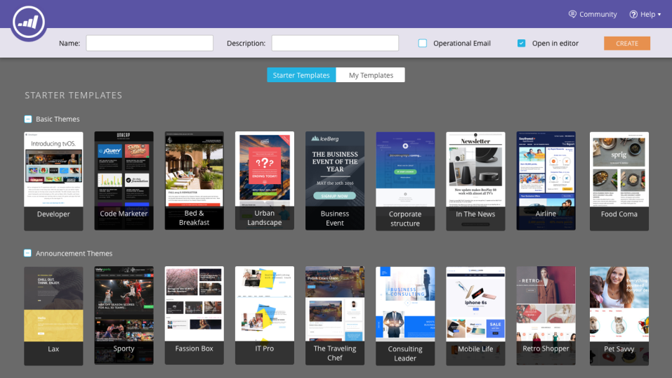

# 電子郵件編輯器v2.0概述 {#email-editor-v-overview}

當您決定啟動電子郵件編輯器v2.0時，您會注意到幾個新功能。

**電子郵件範本選取器**

當您建立新電子郵件時，您會被帶到 [電子郵件範本選取器](/help/marketo/product-docs/email-marketing/general/email-editor-2/email-template-picker-overview.md).

**電子郵件編輯器**

當您開始編輯電子郵件時，您會注意到編輯器有全新的外觀。

**模組**

編輯器右側的這些專案稱為模組。 瞭解如何 [新增模組至您的電子郵件](/help/marketo/product-docs/email-marketing/general/email-editor-2/add-modules-to-your-email.md).

**文字版本**

現在，在電子郵件的HTML版本和文字版本之間切換時，可在底部的方便標籤中進行。 瞭解如何 [編輯電子郵件的文字版本](/help/marketo/product-docs/email-marketing/general/creating-an-email/edit-the-text-version-of-an-email.md).

**電子郵件標題**

需要更多設計空間嗎？ 完成後，可以隱藏電子郵件標頭 [編輯它](/help/marketo/product-docs/email-marketing/general/creating-an-email/edit-your-email-header.md). 只要按一下此圖示……

...且標題會摺疊。

**預覽您的電子郵件**

根據預設，電子郵件會顯示它在案頭上的外觀，如反白顯示的藍色圖示所示。 如果您按一下右側的圖示……

...您將會看到電子郵件在行動裝置上的呈現方式。

如需更大的預覽，請按一下 **預覽** （在電子郵件的右上角）。

預設檢視是案頭……

...但您也可以檢視它在行動裝置上的外觀。 您也可以預覽文字版本！ 只需按一下 **編輯草稿** 以繼續編輯。

**電子郵件動作**

下 **電子郵件動作**，您會發現一些新功能。 **上傳影像或檔案**、和 **從網頁抓取影像**. 您也可以將電子郵件本身儲存為新的電子郵件範本。 您只需為其指定名稱和目的地。

>[!CAUTION]
>
>將電子郵件儲存為範本時，變數值不會延續。 變數將繼續使用基礎範本中指定的預設值。 除非已將電子郵件中的可用模組插入電子郵件內文，否則也不會延續。

>[!NOTE]
>
>**[從網頁抓取影像](/help/marketo/product-docs/demand-generation/images-and-files/grab-the-images-from-a-web-page.md)** 就像在Design Studio中一樣運作。

**停用開啟追蹤** 下 **電子郵件設定**，您可以視需要停用開啟追蹤。

**電子郵件設定**

您可以選擇新增Preheader。 「預覽文字」是在收件匣中檢視電子郵件時，主旨行後面的簡短摘要文字。

>[!CAUTION]
>
>使用電子郵件編輯器時，Token在預覽版中無法運作。 若要在預覽文字中使用Token，必須透過電子郵件範本中您自己的HTML進行。

許多絕佳的新功能！ 玩得開心！

>[!NOTE]
>
>如果您想更深入探究的話，請參閱以下內容 [實用影片](https://nation.marketo.com/videos/1463).

>[!MORELIKETHIS]
>
>[電子郵件範本語法](/help/marketo/product-docs/email-marketing/general/email-editor-2/email-template-syntax.md)
