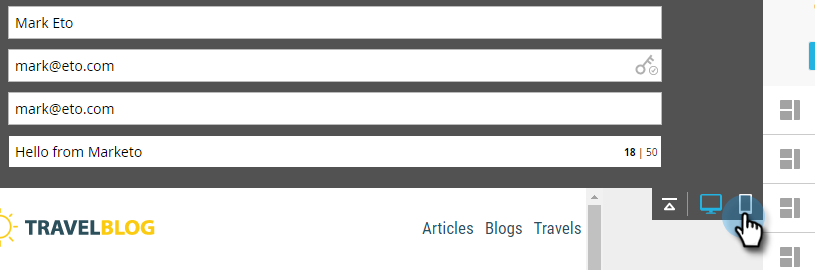

# 電子郵件編輯器 v2.0 概觀 {#email-editor-v2-overview}

傳統電子郵件編輯器的概觀。

>[!IMPORTANT]
>
>雖然尚未設定確切日期，但傳統電子郵件編輯器可能會在2026年遭到取代（屆時會宣佈確切日期）。 強烈建議開始採用進階[電子郵件Designer](/help/marketo/product-docs/email-marketing/email-designer/overview.md){target="_blank"}，因為它有許多傳統編輯器中無法提供的功能。

**電子郵件範本選擇器**

當您建立新電子郵件時，就會進入[電子郵件範本選擇器](/help/marketo/product-docs/email-marketing/general/email-editor-2/email-template-picker-overview.md)。

**電子郵件編輯器**

當您開始編輯電子郵件時，您會注意到編輯器有全新的外觀。

**模組**

編輯器右側的這些專案稱為模組。 瞭解如何[新增模組至您的電子郵件](/help/marketo/product-docs/email-marketing/general/email-editor-2/add-modules-to-your-email.md)。

**文字版本**

現在，在電子郵件的HTML版本和文字版本之間切換，位於底部的方便分頁中。 瞭解如何[編輯電子郵件的文字版本](/help/marketo/product-docs/email-marketing/general/creating-an-email/edit-the-text-version-of-an-email.md)。

**電子郵件標題**

需要更多設計空間嗎？ 電子郵件標頭在您完成[編輯後](/help/marketo/product-docs/email-marketing/general/creating-an-email/edit-your-email-header.md)即可隱藏。 只要按一下此圖示……

...且標題會摺疊。

**預覽您的電子郵件**

預設情況下，電子郵件會顯示它在案頭上的外觀，如反白顯示的藍色圖示所示。 如果您按一下右側的圖示……

...您將會看到電子郵件在行動裝置上的呈現方式。

如需大型預覽，請按一下電子郵件右上角的&#x200B;**[!UICONTROL Preview]**。

預設檢視是案頭……

...但您也可以檢視它在行動裝置上的外觀。 您也可以預覽文字版本！ 只要按一下右上角的&#x200B;**[!UICONTROL Edit Draft]**&#x200B;即可繼續編輯。

**[!UICONTROL Email Actions]**

在&#x200B;**[!UICONTROL Email Actions]**&#x200B;底下，您會注意到一些新功能。 **[!UICONTROL Upload an Image or File]**&#x200B;和&#x200B;**[!UICONTROL Grab Images from Web]**。 您也可以將電子郵件本身儲存為新的電子郵件範本。 您只需為其指定名稱和目的地即可。

>[!CAUTION]
>
>將電子郵件儲存為範本時，變數值不會延續。 變數將繼續使用基礎範本中指定的預設值。 除非已將電子郵件中的可用模組插入電子郵件內文，否則也不會延續。

>[!NOTE]
>
>**[[!UICONTROL Grab Images from Web]](/help/marketo/product-docs/demand-generation/images-and-files/grab-the-images-from-a-web-page.md)**&#x200B;的運作方式與它在[!UICONTROL Design Studio]中的運作方式相同。

**[!UICONTROL Disable Open Tracking]**&#x200B;在&#x200B;**[!UICONTROL Edit Settings]**&#x200B;之下，您可以視需要停用開啟追蹤。

**[!UICONTROL Edit Settings]**

您可以選擇新增[!UICONTROL Preheader]。 [!UICONTROL Preheader]是在收件匣中檢視電子郵件時，主旨行之後的簡短摘要文字。

>[!CAUTION]
>
>使用電子郵件編輯器時，Token無法在[!UICONTROL Preheader]中運作。 若要在[!UICONTROL Preheader]中使用權杖，必須透過電子郵件範本中您自己的HTML進行。

許多絕佳的新功能！ 玩得開心！

>[!NOTE]
>
>如果您想更深入探討，請參閱此[影片](https://nation.marketo.com/videos/1463)。

>[!MORELIKETHIS]
>
>[電子郵件範本語法](/help/marketo/product-docs/email-marketing/general/email-editor-2/email-template-syntax.md)
