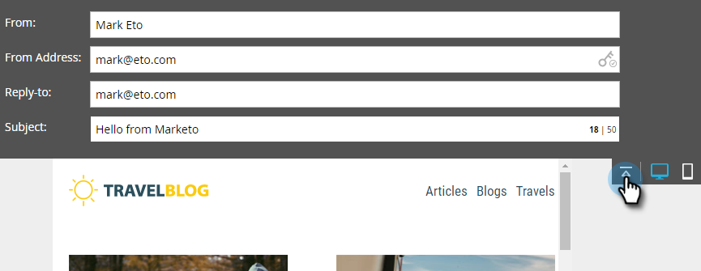
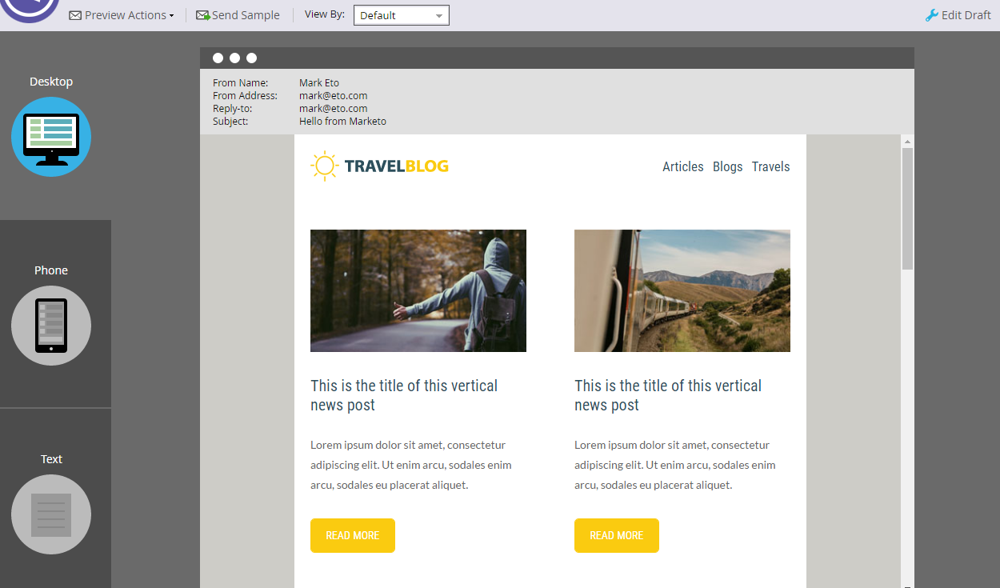

# 電子郵件編輯器 v2.0 概觀 {#email-editor-v2-overview}

傳統電子郵件編輯器的概觀。

>[!IMPORTANT]
>
>雖然未設定確切日期，但傳統電子郵件編輯器可能會在 2026 年淘汰 (我們在確定後會宣佈確切日期)。強烈建議您開始採用進階[電子郵件設計工具](/help/marketo/product-docs/email-marketing/email-designer/overview.md){target="_blank"}，因為其具有許多傳統編輯器無法提供的功能。

**電子郵件範本挑選器**

當您建立新電子郵件時，系統會將您帶到[電子郵件範本挑選器](/help/marketo/product-docs/email-marketing/general/email-editor-2/email-template-picker-overview.md)。

**電子郵件編輯器**

您開始編輯電子郵件時，就會注意到編輯器具有全新外觀。

**模組**

編輯器右側的這些項目稱為模組。了解如何[將模組新增至您的電子郵件](/help/marketo/product-docs/email-marketing/general/email-editor-2/add-modules-to-your-email.md)。

**文字版本**

現在，在電子郵件底部方便好用的索引標籤中即可在 HTML 版本和文字版本之間進行切換。了解如何[編輯電子郵件的文字版本](/help/marketo/product-docs/email-marketing/general/creating-an-email/edit-the-text-version-of-an-email.md)。

**電子郵件標題**

是否需要更多設計空間？電子郵件標頭在您完成[編輯](/help/marketo/product-docs/email-marketing/general/creating-an-email/edit-your-email-header.md)後可能會隱藏起來。只要按一下此圖示…

...標頭會摺疊。

**預覽您的電子郵件**

預設情況下，電子郵件會以桌面版的顯示方式呈現，如反白顯示的藍色圖示所示。如果您按一下右側的圖示…

...您會看到電子郵件在行動裝置上的呈現方式。

如需大型預覽，請按一下電子郵件右上角的 **[!UICONTROL Preview]**。

預設檢視為桌面版…

...但您也可以查看它在行動裝置上的呈現方式。您也可以預覽文字版本！只要按一下右上角的 **[!UICONTROL Edit Draft]** 即可繼續編輯。

**[!UICONTROL Email Actions]**

在 **[!UICONTROL Email Actions]** 底下，您會注意到一些新功能。**[!UICONTROL Upload an Image or File]**，還有 **[!UICONTROL Grab Images from Web]**。您也可以將電子郵件本身儲存為新的電子郵件範本。您只需給予其名稱和目的地即可。

>[!CAUTION]
>
>將電子郵件儲存為範本時，變數值不會保留。變數會繼續使用基礎範本中所指定的預設值。除非已將電子郵件中的可用模組插入電子郵件內文，否則也不會保留。

>[!NOTE]
>
>**[[!UICONTROL Grab Images from Web]](/help/marketo/product-docs/demand-generation/images-and-files/grab-the-images-from-a-web-page.md)** 的運作方式與其在 [!UICONTROL Design Studio] 中的運作方式相同。

**[!UICONTROL Disable Open Tracking]**&#x200B;在 **[!UICONTROL Edit Settings]** 下方，您可以停用開啟追蹤 (如有必要)。

**[!UICONTROL Edit Settings]**

您可以選擇新增 [!UICONTROL Preheader]。[!UICONTROL Preheader] 是在收件匣中檢視電子郵件時，在主旨行之後顯示的簡短摘要文字。

>[!CAUTION]
>
>使用電子郵件編輯器時，權杖無法在 [!UICONTROL Preheader] 中運作。若要在 [!UICONTROL Preheader] 中使用權杖，您必須透過電子郵件範本中您自己的 HTML 進行。

有許多很棒的新功能！祝您有愉快的使用體驗！

>[!NOTE]
>
>如果您想更深入探討，請參閱這段[影片](https://nation.marketo.com/videos/1463)。

>[!MORELIKETHIS]
>
>[電子郵件範本語法](/help/marketo/product-docs/email-marketing/general/email-editor-2/email-template-syntax.md)
