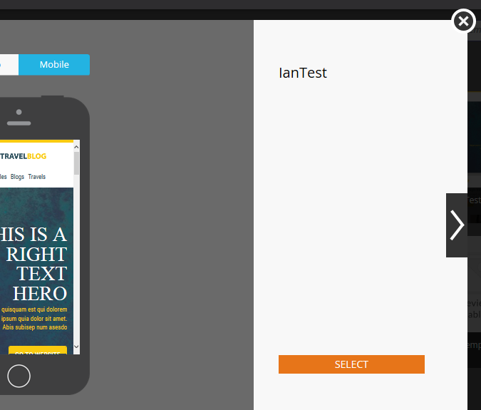

# 電子郵件範本選取器概觀 {#email-template-picker-overview}

當您 [建立電子郵件](/help/marketo/product-docs/email-marketing/general/creating-an-email/create-an-email.md)，您有數個可供選擇的自由範本。 您也可以建立自己的範本，並儲存以供日後使用。

**名稱** 將是您根據範本建立的電子郵件名稱，而不是範本本身。 **說明** 也會套用至電子郵件，且為選用。

如果您的電子郵件很關鍵，而且您想要它避開通訊限制， [使其可運作](/help/marketo/product-docs/email-marketing/general/functions-in-the-editor/make-an-email-operational.md) 核取方塊。 **在編輯器中開啟** 預設為選取，僅代表您想要立即開始編輯新電子郵件。 **建立** 意思是，建立！

**入門範本** 包括立即可用的回應式電子郵件範本集合。 您可以照原樣使用，或根據您的喜好自訂這些功能。

**我的範本** 包含您已建立的所有範本。 您也可能有資料夾。

顯示在Design Studio樹狀結構中「電子郵件>範本」下的所有資料夾都可在 **我的範本**.

若要預覽範本，請將滑鼠游標停留在範本縮圖上，然後按一下 **預覽**. 您也可以按兩下它。

預覽器會顯示範本在桌上型電腦上的呈現方式……

...和行動裝置。

如果您喜歡此範本，請按一下以選擇它 **選取** 右下角。 想繼續找嗎？ 按一下 **X** 右上角。 使用左右箭頭來捲動範本。

您也可以以滑鼠右鍵按一下範本縮圖以瞭解更多選項。

>[!NOTE]
>
>範本縮圖很酷的一點是，它們是即時的。 因此，如果您對範本進行變更，縮圖也會隨之變更。

相當整潔！

>[!MORELIKETHIS]
>
>* [電子郵件範本語法](/help/marketo/product-docs/email-marketing/general/email-editor-2/email-template-syntax.md)
>* [建立電子郵件](/help/marketo/product-docs/email-marketing/general/creating-an-email/create-an-email.md)
