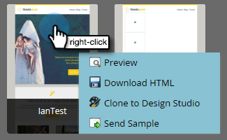

# 電子郵件範本選擇器概述 {#email-template-picker-overview}

當您 [建立電子郵件](/help/marketo/product-docs/email-marketing/general/creating-an-email/create-an-email.md)，您有數個可供選擇的免費範本。 您也可以建立自己的範本並儲存以供日後使用。

**名稱** 會是您根據範本建立的電子郵件名稱，而非範本本身。 **說明** 也會套用至電子郵件，且為選用。

如果您的電子郵件至關重要，而您希望它避開通信限制， [使其正常運行](/help/marketo/product-docs/email-marketing/general/functions-in-the-editor/make-an-email-operational.md) 勾選方塊。 **在編輯器中開啟** 預設為選取，而這只是表示您想立即開始編輯新電子郵件。 **建立** 意味著建立！

**入門範本** 包含一系列可立即執行的回應式電子郵件範本。 您可以依原樣使用，或依您的喜好自訂。

**我的範本** 包含您建立的所有範本。 您也可能有資料夾。

顯示在Design Studio樹中「電子郵件>模板」下的所有資料夾都可在 **我的範本**.

若要預覽範本，請將滑鼠指標暫留在範本的縮圖上，然後按一下 **預覽**. 您也可以按兩下它。

預覽器顯示模板在台式電腦上的呈現方式……

...和行動裝置。

如果您喜歡此範本，請按一下 **選擇** 在右下角。 想繼續找嗎？ 按一下 **X** 在右上角。 使用向左和向右箭頭滾動模板。

您也可以以滑鼠右鍵按一下範本縮圖以取得更多選項。

>[!NOTE]
>
>範本縮圖的酷之處在於，它們是即時的。 因此，如果您對範本進行變更，縮圖會隨之變更。

很整潔！

>[!MORELIKETHIS]
>
>* [電子郵件範本語法](/help/marketo/product-docs/email-marketing/general/email-editor-2/email-template-syntax.md)
>* [建立電子郵件](/help/marketo/product-docs/email-marketing/general/creating-an-email/create-an-email.md)

