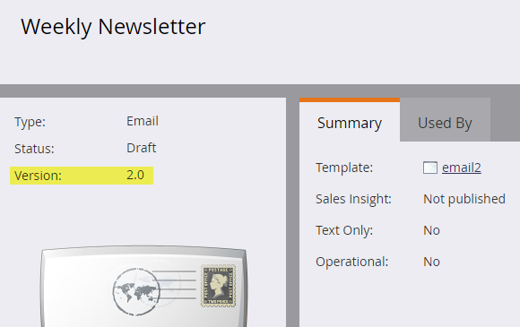

# 轉換為電子郵件編輯器2.0 {#transitioning-to-email-editor}

自』19年6月發行版本起，所有Marketo訂閱已轉換至電子郵件編輯器2.0。 [深入了解](https://nation.marketo.com/docs/DOC-7038) 關於淘汰電子郵件編輯器1.0。

訂閱中的電子郵件和電子郵件範本應有版本號碼。 您可以在資產的摘要頁面中找到版本。

依預設，如果您的所有現有電子郵件和電子郵件範本是在』16年春季版之前或在停用電子郵件編輯器2.0時的發行之後建立，則會標示為v1.0。 現在自動啟用電子郵件編輯器2.0後，您會看到下列行為：

* 建立新電子郵件時， [電子郵件範本選擇器](email-template-picker-overview.md) 會顯示，您將可以選擇v2.0電子郵件範本。
* 每當您使用電子郵件編輯器2.0建立或編輯電子郵件時，產生的電子郵件 **always** 標示為v2.0（即使您使用v1.0電子郵件範本亦然）。

如果您的訂閱在移至電子郵件編輯器2.0之前有v1.0電子郵件，您將會根據資產的目前狀態遇到下列行為：

**已核准**  — 按一下「編輯草稿」會建立已核准電子郵件的v2.0草稿。 如果您接著核准v2.0草稿，則電子郵件的已核准狀態會變成v2.0，因此無法回復到v1.0。\
**草稿**  — 按一下「編輯草稿」會自動將該草稿標示為v2.0。此時，將無法捨棄並回復為v1.0，因為沒有已核准的資產版本。
**用草稿批准**  — 按一下「編輯草稿」後，系統會自動將該草稿標示為v2.0。因此，您也無法將草稿還原回v1.0。

如果您的訂閱在移至電子郵件編輯器2.0之前有v1.0的電子郵件範本，您會遇到下列行為：

**已核准**  — 按一下「編輯草稿」將建立現有電子郵件範本的v2.0草稿。
**草稿**  — 按一下「編輯草稿」會自動將該草稿標示為v2.0。此時，無法捨棄並回復為v1.0，因為沒有已核准的資產版本。
**用草稿批准**  — 按一下「編輯草稿」會自動將該草稿標示為v2.0。因此，也無法將草稿還原回v1.0。

如果您核准先前為v1.0（處於上述任一狀態）的電子郵件範本，您會看到下列行為：

針對使用（舊版1.0）範本的現有v1.0電子郵件：\
**核准的v1.0電子郵件**  — 將為此電子郵件建立v2.0草稿，仍使用新批准的v2.0範本。 也會收到任何範本變更。\
**草稿v1.0電子郵件**  — 草稿將保持v1.0，直到您按一下「編輯草稿」為止。 之後，系統會自動將其標示為v2.0，並接收任何範本變更。\
**以草稿v1.0電子郵件核准**  — 草稿將保持v1.0，直到您按一下「編輯草稿」為止。 之後，系統會自動將其標示為v2.0，並接收任何範本變更。

針對使用（舊版1.0）範本的現有v2.0電子郵件：\
**核准的v2.0電子郵件**  — 將為此電子郵件建立v2.0草稿，仍「使用」新核准的範本，且將收到任何範本變更。\
**草稿v2.0電子郵件**  — 草稿將保持原樣(v2.0)，並接收任何範本變更。\
**使用草稿v2.0電子郵件核准**  — 草稿將保持原樣(v2.0)，並接收任何範本變更。

>[!CAUTION]
>
>如果您核准v1.0電子郵件範本的v2.0草稿，範本就會變成v2.0。有 **no way** 將其還原回v1.0。

注意事項

* 核准的電子郵件 **從不** 已變更。

* 核准的電子郵件範本包括 **從不** 已變更。

* 幾個 **稀有** 在情況下，v1.0電子郵件無法在電子郵件編輯器2.0中開啟。如果發生此情況，請捨棄草稿，並聯絡Marketo支援。

>[!MORELIKETHIS]
>
>* [電子郵件編輯器2.0概述](/help/marketo/product-docs/email-marketing/general/email-editor-2/email-editor-v2-0-overview.md)
>* [電子郵件範本語法](/help/marketo/product-docs/email-marketing/general/email-editor-2/email-template-syntax.md)

