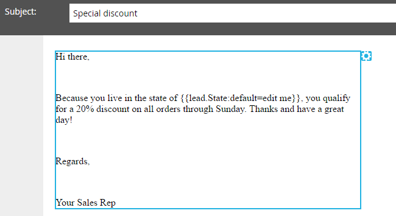

# 新增程式碼片段至電子郵件 {#add-a-snippet-to-an-email}

程式碼片段是可重複使用的RTF和圖形區塊，可用於電子郵件和登入頁面。

>[!PREREQUISITES]
>
>[建立程式碼片段](/help/marketo/product-docs/personalization/segmentation-and-snippets/snippets/create-a-snippet.md)

>[!NOTE]
>
>您無法在代碼片段中內嵌任何[Marketo電子郵件語法](/help/marketo/product-docs/email-marketing/general/email-editor-2/email-template-syntax.md)；它&#x200B;**無法**&#x200B;在電子郵件中運作。 程式碼片段應該只是本文內容(HTML + TEXT)。

1. 尋找您的電子郵件，選取並按一下&#x200B;**[!UICONTROL Edit Draft]**。

   

1. 選取您要轉換成程式碼片段的可編輯區域，按一下齒輪圖示並選取&#x200B;**[!UICONTROL Replace with Snippet]**。

   

1. 選取您選擇的程式碼片段，然後按一下&#x200B;**[!UICONTROL Save]**。

   

   >[!NOTE]
   >
   >下拉式清單中只會顯示已核准的程式碼片段。

   

   >[!NOTE]
   >
   >每次您更新並核准程式碼片段時，變更都會反映在電子郵件中。 除非您核准含有[No-Draft](/help/marketo/product-docs/administration/users-and-roles/enable-no-draft-for-snippets.md)的程式碼片段，否則將會草擬電子郵件。

這是重複使用動態內容的快速輕鬆方法。
