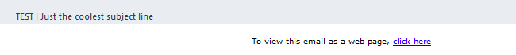

# 將檢視新增為網頁連結至電子郵件 {#add-a-view-as-web-page-link-to-an-email}

電子郵件的功能有限（CSS有限，無JavaScript或表單）。 使用「以網頁形式檢視」來提供連結，以在瀏覽器中顯示您的電子郵件。 這將會使用Munchkin對收件者進行Cookie。

>[!NOTE]
>
>建立新電子郵件時，未啟用以網頁檢視。 如果啟用並複製電子郵件，則會複製此設定。

1. 選取您的電子郵件並按一下 **編輯草稿**.

   

1. 在電子郵件編輯器中，按一下 **電子郵件設定**.

   

1. 檢查 **以網頁形式包含檢視** 方塊並按一下 **儲存**.

   

以下是它的外觀範例：

>[!TIP]
>
>在傳送電子郵件之前，您不會看到「以網頁檢視」連結。 傳送測試給您自己以檢視。

若要變更預設文字，請參閱 [編輯「以網頁檢視」訊息](/help/marketo/product-docs/administration/email-setup/edit-the-view-as-web-page-message.md).
