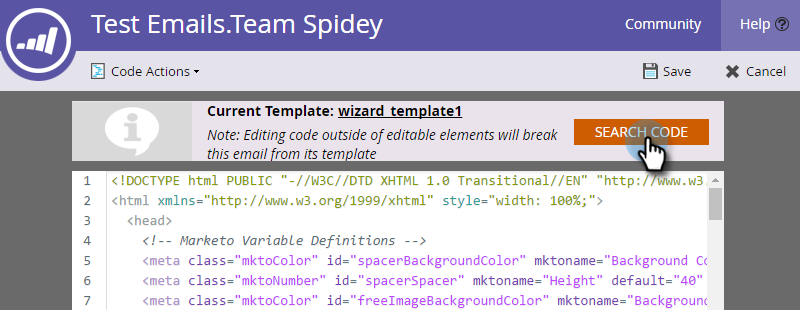

# 編輯電子郵件的 HTML {#edit-an-emails-html}

有時您可能需要修改電子郵件的基礎HTML。 有時您可以使用外部系統來設計和建置電子郵件的程式碼。 無論是哪種方式，您都可以輕鬆地從電子郵件編輯器匯入及/或編輯程式碼。

## 編輯HTML {#edit-html}

1. 選取您的電子郵件並按一下&#x200B;**[!UICONTROL Edit Draft]**。

   

1. 按一下「**[!UICONTROL Edit Code]**」。

   

1. 進行任何變更。 完成時，按一下&#x200B;**[!UICONTROL Save]**。

   

   >[!NOTE]
   >
   >隨心所欲地變更。 您可以取代整個HTML或進行微幅調整。

1. 按一下&#x200B;**[!UICONTROL Code Actions]**&#x200B;下拉式清單，將程式碼下載為.html檔案、內嵌您的CSS或驗證HTML。

   

   >[!NOTE]
   >
   >電子郵件的最佳實務是讓您的所有樣式內嵌。 有數個電子郵件使用者端不支援`<head>`區段內的CSS。

## 從範本中斷電子郵件 {#breaking-an-email-from-its-template}

這些程式碼變更&#x200B;**不會**&#x200B;中斷範本中的電子郵件：

* 編輯任何模組的內容（包括在模組內新增元素）
* 將新模組新增至容器
* 從容器中刪除模組

* 變更模組外任何元素的mkto特定屬性（例如「mktoName」或「mktoImgUrl」）
* 在模組外編輯任何元素的內容（RTF文字、影像、視訊等）

您可以在程式碼編輯器&#x200B;**中執行的下列操作會**&#x200B;中斷電子郵件範本中的郵件：

* 在元素或模組之外變更程式碼中的任何專案
* 新增或變更模組外任何元素的非mkto屬性（例如，「id」或「style」）
* 刪除模組以外的元素

## 搜尋代碼 {#search-code}

使用搜尋代碼功能，有效率地尋找及取代您電子郵件之HTML代碼中的內容。

1. 在電子郵件的程式碼中，按一下&#x200B;**[!UICONTROL Search Code]**。

   

1. 輸入您要尋找的內容，然後按一下&#x200B;**[!UICONTROL Find Next]**&#x200B;往前搜尋，或按一下&#x200B;**[!UICONTROL Find Previous]**&#x200B;往後搜尋。 您也有選項&#x200B;**[!UICONTROL Replace]**&#x200B;和&#x200B;**[!UICONTROL Replace All]**。

   

1. 完成時，按一下&#x200B;**[!UICONTROL Close]**。

   

   >[!NOTE]
   >
   >搜尋代碼也可在[電子郵件範本編輯器](/help/marketo/product-docs/email-marketing/general/email-editor-2/create-an-email-template.md)中使用。

我們建議您使用Marketo的內建功能繼續編輯電子郵件，但此程式碼編輯器可讓您在需要時提供彈性。
