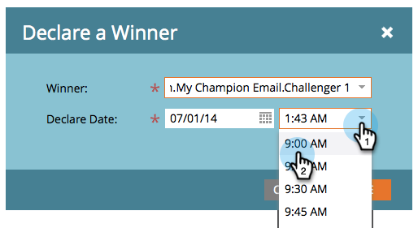

# 冠軍/挑戰者：宣佈冠軍 {#champion-challenger-declare-a-champion}

準備好後，您可以宣告電子郵件測試的冠軍。

>[!MORELIKETHIS]
>
>[冠軍/挑戰者：核准您的電子郵件測試](/help/marketo/product-docs/email-marketing/general/functions-in-the-editor/email-tests-champion-challenger/champion-challenger-approve-your-email-test.md)

1. 前往 **行銷活動**.

   

1. 尋找並以滑鼠右鍵按一下您的電子郵件測試，然後按一下 **Declare Champion**.

   

1. 選取 **獲勝者** 你自己選擇的。

   

1. 設定 **宣告日期**.

   >[!NOTE]
   >
   >直到 **宣告日期**,Marketo會繼續傳送舊冠軍和挑戰者。 一旦達到日期/時間，則只會傳送新冠軍。

   

   >[!CAUTION]
   >
   >請注意，預設 **宣告日期** 是明天，不是今天。

1. 選取時間並按一下 **儲存**.

   

   Rad! 現在您知道如何輕鬆執行電子郵件測試，以在不中斷促銷活動的情況下改善內容。
