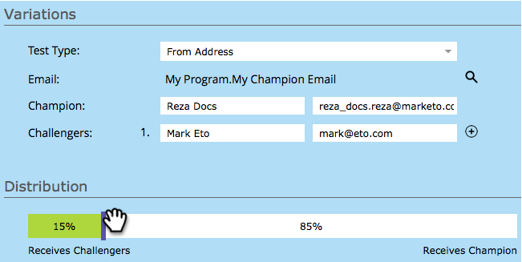

# 冠軍/挑戰者：寄件者地址 {#champion-challenger-from-address}

想不要小題大做地嘗試不同的地址嗎？ 這是方法。

>[!PREREQUISITES]
>
>[新增電子郵件冠軍/挑戰者](/help/marketo/product-docs/email-marketing/general/functions-in-the-editor/email-tests-champion-challenger/add-an-email-champion-challenger.md)

1. 在電子郵件測試編輯器中，選取 **寄件者地址** 在 **測試類型** 下拉式清單。

   

   >[!NOTE]
   >
   >第一個寄件者地址指定為 **冠軍**. 後續的地址被調用 **挑戰者**.

1. 輸入 **從名稱** （左）和 **寄件者地址** （右）挑戰者。

   

   >[!TIP]
   >
   >如果您想要多個挑戰者，請按一下加號，然後輸入其他名稱和電子郵件。

1. 拖曳滑桿以決定將百分比分割給收到冠軍「寄件者地址」電子郵件的使用者，以及收到挑戰者「寄件者地址」電子郵件的使用者。

   

   >[!NOTE]
   >
   >**範例**
   >
   >在上方顯示的分送中，智慧清單中指定之總對象的15%會收到其中一封具有「來自位址」挑戰者的電子郵件，而85%會收到具有「來自位址」挑戰者的電子郵件。 來自多個挑戰者的電子郵件來自地址，平均分享15%。 測試結束時，您可以手動宣告獲勝者。 從那以後，所有未來的人都會獲得表現更好的內容。

   若要獲得統計信賴度，請確定您選擇的百分比包含的人數足夠，讓您的測試有效。 不要被沒有結果的結果愚弄。 [關於統計信賴度的資訊超出您的期望](https://en.wikipedia.org/wiki/Confidence_interval).

1. 按一下 **下一個**.

   

   進度! 繼續吧。

   >[!MORELIKETHIS]
   >
   >[冠軍/挑戰者：定義Champion條件](/help/marketo/product-docs/email-marketing/general/functions-in-the-editor/email-tests-champion-challenger/champion-challenger-define-champion-criteria.md)
