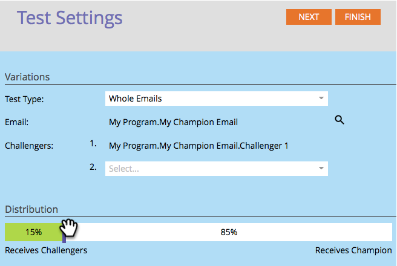

# 冠軍/挑戰者：完整電子郵件 {#champion-challenger-whole-emails}

測試整封電子郵件。 測試結束時，請發送最佳執行者。

>[!PREREQUISITES]
>
>[新增電子郵件冠軍/挑戰者](/help/marketo/product-docs/email-marketing/general/functions-in-the-editor/email-tests-champion-challenger/add-an-email-champion-challenger.md)

1. 在電子郵件測試編輯器中，選取 **完整電子郵件** 在 **測試類型** 下拉式清單。

   

   >[!NOTE]
   >
   >記住：原始電子郵件是冠軍。 挑戰者與它競爭。

1. 尋找並選取 **挑戰者** 電子郵件，然後按一下 **原地複製**.

   

   >[!TIP]
   >
   >複製會製作電子郵件測試下的挑戰者電子郵件副本。

1. 拖曳滑桿以決定收到挑戰者與冠軍電子郵件的人數比例分割。

   

   >[!NOTE]
   >
   >**範例**
   >
   >在上方顯示的分送中，智慧清單中指定的總對象中，有15%會收到其中一封挑戰者電子郵件，85%會收到冠軍電子郵件。 多封挑戰者電子郵件的分享率均為15%。 測試結束時，您可以手動宣告獲勝者。 從那以後，所有未來的人都會獲得表現更好的內容。

   若要獲得統計信賴，請確定您指派給挑戰者的百分比包含足夠的人員，讓您的測試有效。 不要被沒有結果的結果愚弄。

   [關於統計信賴度的資訊超出您的期望](https://en.wikipedia.org/wiki/Confidence_interval).

1. 按一下 **下一個**.

   

1. 進度! 繼續吧。

   >[!MORELIKETHIS]
   >
   >[冠軍/挑戰者：定義Champion條件](/help/marketo/product-docs/email-marketing/general/functions-in-the-editor/email-tests-champion-challenger/champion-challenger-define-champion-criteria.md)
