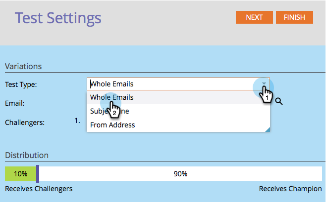

# 冠軍/挑戰者：整封電子郵件 {#champion-challenger-whole-emails}

相互測試整個電子郵件。 測試結束後，請傳送最佳執行者。

>[!PREREQUISITES]
>
>[新增電子郵件冠軍/挑戰者](/help/marketo/product-docs/email-marketing/general/functions-in-the-editor/email-tests-champion-challenger/add-an-email-champion-challenger.md)

1. 在電子郵件測試編輯器中，選取&#x200B;**[!UICONTROL Whole Emails]**&#x200B;下拉式清單中的&#x200B;**[!UICONTROL Test Type]**。

   

   >[!NOTE]
   >
   >請記住：原始電子郵件是冠軍。 挑戰者與它競爭。

1. 尋找並選取&#x200B;**[!UICONTROL Challengers]**&#x200B;封電子郵件，然後按一下&#x200B;**[!UICONTROL Clone]**。

   

   >[!TIP]
   >
   >複製會在電子郵件測試下複製挑戰者電子郵件。

1. 拖曳滑桿以決定收到挑戰者與冠軍電子郵件之人員的百分比分割。

   

   >[!NOTE]
   >
   >**範例**
   >
   >在上述分佈中，智慧清單中指定的總受眾中，有15%會收到挑戰者電子郵件，有85%會收到冠軍電子郵件。 多個挑戰者電子郵件會平均分享這15%的內容。 測試結束後，您可以手動宣告獲勝者。 從那時起，所有未來的人都會獲得表現較好的內容。 在「觸發促銷活動」中，由於分佈可能不會與所選百分比完全一致，因此實現的百分比可能與您選取的百分比不同。 當一個變體處理大量已取消訂閱的人員時，或當一個變體是操作電子郵件，而其他變體不是，就可能發生這種情況。

   若要取得統計上的可信度，請確定您指派給挑戰者的百分比包含足夠的人員，讓您的測試有效。 不要被不確定的結果所愚弄。

1. 按一下&#x200B;**下一步**。

   

1. 進行中！ 讓我們繼續進行。

   >[!MORELIKETHIS]
   >
   >[冠軍/挑戰者：定義冠軍條件](/help/marketo/product-docs/email-marketing/general/functions-in-the-editor/email-tests-champion-challenger/champion-challenger-define-champion-criteria.md)
