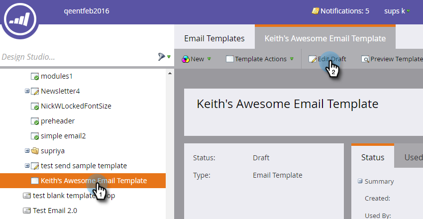
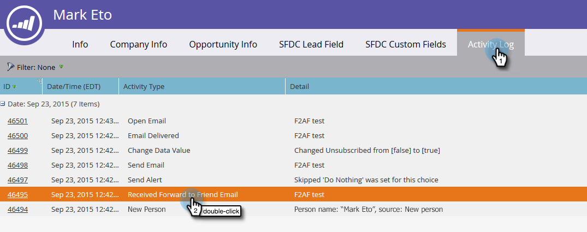
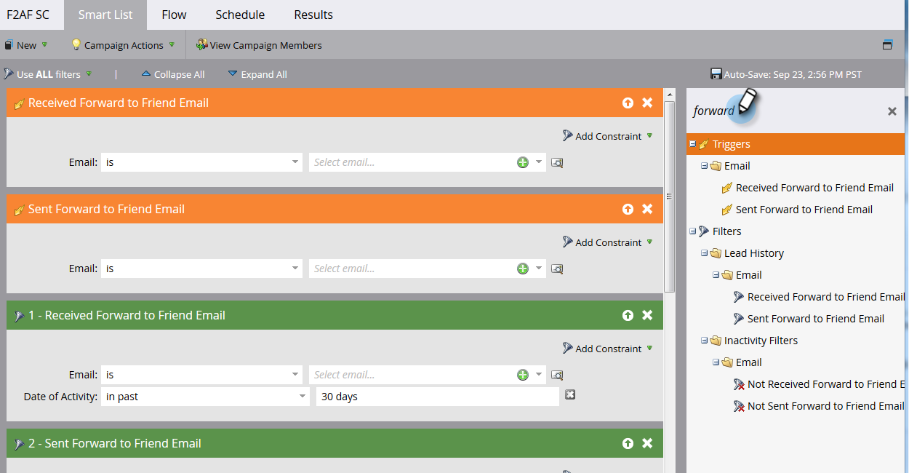

# 在電子郵件中轉寄給朋友連結 {#forward-to-a-friend-link-in-emails}

將「轉寄給朋友」連結新增至您的電子郵件，可讓您追蹤透過此連結收到轉寄電子郵件的人員，如果資料庫中尚未有這些人員，會自動新增為新人員。

例如，假設Keith使用「轉寄給朋友」連結將電子郵件轉寄給未知人員Mark。 Mark會自動新增為新人員，並獲指派自己的Cookie，而他的任何電子郵件和網頁活動都會連結至他。 然而，如果Keith在其電子郵件使用者端中使用forward按鈕，則Mark會錯誤地被識別為Keith，並且其活動會記錄為Keith的。

## 新增電子郵件範本的連結 {#add-the-link-to-an-email-template}

1. 前往 **Design Studio**.

   

1. 尋找並選取您要新增連結的電子郵件範本。 按一下 **編輯草稿**.

   

1. 將下列HTML程式碼貼到您希望顯示「轉寄給朋友」連結的位置（如果您需要此零件的協助，請洽詢您的網頁開發人員）：

   `<pre data-theme="Confluence"><a href="{{system.forwardToFriendLink}}">Forward to Friend</a></pre>`

   

   >[!TIP]
   >
   >
   >您可以在連結中新增樣式，使其看起來更好看。 例如：
   >
   >`<a href="{{system.forwardToFriendLink}}" style="font-family:arial, sans-serif; padding:10px; position:absolute; right:0px;">Forward to Friend</a>`

   >[!CAUTION]
   >
   >我們不建議使用樣式 **position：relative** 在電子郵件範本中。 這可能會造成「轉寄給朋友」方塊的位置和顯示問題。

1. 按一下 **預覽草稿** 以確保範本看起來如您所願。

   

   >[!NOTE]
   >
   >請記得核准範本草稿以套用變更。

   現在，所有使用該範本的電子郵件都會有「轉寄給朋友」連結。 當電子郵件收件者按一下該按鈕，就會被帶往含有「轉寄給朋友」方塊的電子郵件網頁版本：

   

## 新增個別電子郵件的連結 {#add-the-link-to-an-individual-email}

您也可以將「轉寄給朋友」連結直接新增至電子郵件中。

1. 開啟您要包含連結的電子郵件，然後按兩下可編輯區域。

   

1. 將游標放在您要顯示連結的位置，然後按一下 **插入Token** 按鈕。

   

1. 選取 **`{{system.forwardToFriendLink}}`** token。

   

   >[!NOTE]
   >
   >此Token是帶有「轉寄給朋友」方塊的電子郵件網頁版本的URL。

1. 寫出您希望連結的顯示文字內容（例如「轉寄給朋友」）。

   

1. 剪下 **`{{system.forwardToFriendLink}}`** 使用Ctrl+X (Windows)或Cmd+X (Mac)的Token。 反白顯示「轉寄給朋友」並按一下 **插入/編輯連結** 按鈕。

   

1. 貼上 **`{{system.forwardToFriendLink}}`** token放入 **URL** 使用Ctrl/Cmd+V方塊並按一下 **插入**.

   

1. 儲存編輯並預覽您的新連結！

   

   >[!NOTE]
   >
   >透過接收「轉寄給朋友」電子郵件而新增的新人預設會取消訂閱行銷電子郵件。

## 檢視轉送活動 {#view-forwarding-activity}

您可以在人員的活動記錄檔中檢視誰轉寄及收到電子郵件。

1. 前往 **`Database`**.

   

1. 連按兩下您要檢視活動的人員。

   

1. 前往 **活動記錄** 標籤。 按兩下 **已接收轉寄給朋友的電子郵件** 或 **轉寄給朋友的電子郵件** 以檢視詳細資訊。

   

   >[!NOTE]
   >
   >**定義**
   >
   >針對已接收的「轉寄給朋友」電子郵件，人員ID是轉寄電子郵件的人員。
   >
   >對於「轉寄給朋友」電子郵件，人員ID是收到電子郵件的人。

   

1. 若要依識別碼檢視人員，請複製並貼上 **個人ID** 到URL結尾(上述URL的開頭將取決於您的Marketo執行個體)：

   `<pre data-theme="Confluence">...marketo.com/Database/loadPersonDetail?personId=</pre>`

   >[!NOTE]
   >
   >我們將製作 **個人ID** 可點按，並直接連結至近期修補程式中的人員。

   

   >[!NOTE]
   >
   >如果收到轉寄的朋友是未知的人，則會建立新人員，並標示為人員的「轉寄給朋友」 **來源**.
   >如果電子郵件是方案的本機資產，則方案會標示為個人的 **贏取方案**.

## 使用轉送活動觸發或篩選 {#trigger-or-filter-using-forwarding-activity}

共有六個觸發器/篩選器可用來觸發流量動作，或依傳送和接收的「轉寄給朋友」活動來篩選人員。

在智慧行銷活動的智慧清單中，如果您搜尋「轉發」，將會找到可用的觸發器和篩選器。

## 測試轉寄給朋友 {#test-forward-to-friend}

若要測試「轉寄給朋友」，請傳送一封包含轉寄連結的電子郵件給您自己。 請務必透過以下網址傳送： **傳送電子郵件** 流程步驟， *not* 到 **傳送測試電子郵件**.
