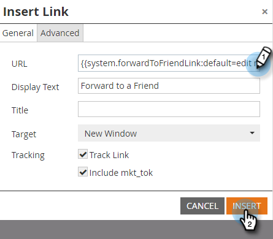
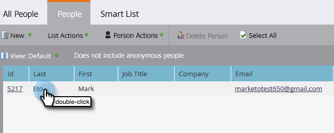

# 在電子郵件中轉寄給朋友連結 {#forward-to-a-friend-link-in-emails}

將「轉寄給朋友」連結新增至您的電子郵件，可讓您追蹤透過此連結收到轉寄電子郵件的人員，如果這些人不在資料庫中，會自動新增為新人員。

例如，假設Keith使用「轉寄給朋友」連結將電子郵件轉寄給不明人員Mark。 Mark會自動新增為新人員，且會獲得指派給他自己的Cookie，而他的任何電子郵件和網頁活動都會連結到他。 然而，如果Keith在其電子郵件使用者端中使用「轉寄」按鈕，則Mark會錯誤地編碼為Keith，而他的活動會記錄為Keith的。

## 將連結新增至電子郵件範本 {#add-the-link-to-an-email-template}

1. 移至&#x200B;**[!UICONTROL Design Studio]**。

   

1. 尋找並選取您要新增連結的電子郵件範本。 按一下「**[!UICONTROL Edit Draft]**」。

   

1. 將下列HTML程式碼貼到您希望「轉寄給朋友」連結出現的位置（如果您需要此部分的協助，請洽詢您的網頁開發人員）：

   `<a href="{{system.forwardToFriendLink}}">Forward to Friend</a>`

   

   >[!TIP]
   >
   >
   >您可以在連結中新增樣式，讓它看起來更好看。 例如：
   >
   >`<a href="{{system.forwardToFriendLink}}" style="font-family:arial, sans-serif; padding:10px; position:absolute; right:0px;">Forward to Friend</a>`

   >[!CAUTION]
   >
   >我們不建議在您的電子郵件範本中使用樣式&#x200B;**position:relative**。 這可能會造成「轉寄給朋友」方塊的位置和顯示問題。

1. 按一下&#x200B;**[!UICONTROL Preview Draft]**&#x200B;以確定範本看起來是您想要的。

   

   >[!NOTE]
   >
   >記得核准範本草稿以套用變更。

   現在，所有使用該範本的電子郵件都會有「轉寄給朋友」連結。 當電子郵件收件者按一下該按鈕，就會被帶往含有「轉寄給朋友」方塊的電子郵件的Web版本：

   

## 將連結新增至個別電子郵件 {#add-the-link-to-an-individual-email}

您也可以將「轉寄給朋友」連結直接新增至電子郵件中。

1. 開啟您要包含連結的電子郵件，然後按兩下可編輯區域。

   

1. 將游標放在您要顯示連結的位置，然後按一下&#x200B;**插入權杖**&#x200B;按鈕。

   

1. 選取&#x200B;**`{{system.forwardToFriendLink}}`**&#x200B;權杖。

   

   >[!NOTE]
   >
   >此Token是帶有「轉寄給朋友」方塊之電子郵件網頁版本的URL。

1. 寫出您希望連結的顯示文字內容（例如「轉寄給朋友」）。

   

1. 使用Ctrl+X (Windows)或Cmd+X (Mac)剪下&#x200B;**`{{system.forwardToFriendLink}}`**&#x200B;權杖。 反白顯示[轉寄給朋友]，然後按一下[插入/編輯連結]按鈕&#x200B;**。**

   

1. 使用Ctrl/Cmd+V將&#x200B;**`{{system.forwardToFriendLink}}`**&#x200B;權杖貼到&#x200B;**URL**&#x200B;方塊中，然後按一下&#x200B;**[!UICONTROL Insert]**。

   

1. 儲存編輯並預覽您的新連結！

   

   >[!NOTE]
   >
   >透過接收「轉寄給朋友」電子郵件而被新增的新朋友，預設會取消訂閱行銷電子郵件。

## 檢視轉送活動 {#view-forwarding-activity}

您可以在個人的活動記錄中檢視誰轉寄及收到電子郵件。

1. 移至&#x200B;**[!UICONTROL Database]**。

   

1. 連按兩下您要檢視活動的人員。

   

1. 前往&#x200B;**[!UICONTROL Activity Log]**&#x200B;標籤。 連按兩下&#x200B;**[!UICONTROL Received Forward to Friend Email]**&#x200B;或&#x200B;**[!UICONTROL Sent Forward to Friend Email]**&#x200B;以檢視詳細資料。

   

   >[!NOTE]
   >
   >**定義**
   >
   >對於已接收的「轉寄給朋友」電子郵件，人員ID是轉寄電子郵件的人員。
   >
   >對於轉寄給朋友的電子郵件，人員ID是收到電子郵件的人員。

   

1. 若要依ID檢視人員，請將&#x200B;**人員ID**&#x200B;複製並貼到URL結尾(URL的開頭取決於您的Marketo執行個體)：

   `...marketo.com/Database/loadPersonDetail?personId=`

   >[!NOTE]
   >
   >我們會在即將推出的修補程式中將&#x200B;**[!UICONTROL Person ID]**&#x200B;設定為可點按，並直接連結至人員。

   

   >[!NOTE]
   >
   >如果接收轉寄的朋友是未知人員，則會建立新人員，並標示為人員的&#x200B;**Source**的「轉寄給朋友」。
   >如果電子郵件是方案的本機資產，則方案會標示為人員的&#x200B;**贏取方案**。

## 使用轉送活動觸發或篩選 {#trigger-or-filter-using-forwarding-activity}

共有六個觸發器/篩選器可供您用來觸發流量動作，或依已傳送及已接收的「轉寄給朋友」活動來篩選人員。

在智慧行銷活動的智慧清單中，如果您搜尋「轉發」，您會找到可用的觸發器和篩選器。

## 測試轉寄給朋友 {#test-forward-to-friend}

若要測試「轉寄給朋友」，請傳送一封包含轉寄連結的電子郵件給您自己。 請確定您是透過&#x200B;**傳送電子郵件**&#x200B;流程步驟傳送，*不是*&#x200B;透過&#x200B;**傳送測試電子郵件**。
