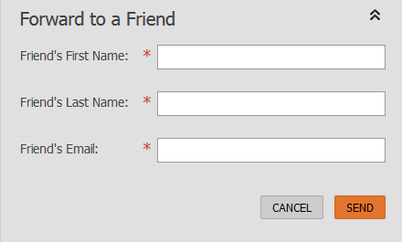

# 轉寄至電子郵件中的朋友連結 {#forward-to-a-friend-link-in-emails}

將「轉寄給朋友」連結新增至您的電子郵件，可讓您追蹤透過此連結收到轉寄電子郵件的人員，並自動將他們新增為不在資料庫中的新人。

例如，假設Keith使用「轉寄給朋友」連結，將電子郵件轉寄給未知的人Mark。 Mark會自動新增為新人，並獲得自己的Cookie，而且他的任何電子郵件和網頁活動都會連結到他。 不過，如果Keith使用其電子郵件客戶端中的轉寄按鈕，Mark會以Keith的身分被錯誤地轉送，而他的活動則以Keith&#39;s的身分記錄。

>[!NOTE]
>
>**FYI**
>
>Marketo現在正在標準化所有訂閱的語言，因此您可能會在您的訂閱中看到潛在客戶／潛在客戶，並在docs.marketo.com中看到個人／人員。 這些術語意義相同；它不會影響文章指示。 還有一些其他變化。 [進一步瞭解](http://docs.marketo.com/display/DOCS/Updates+to+Marketo+Terminology)。

## 新增電子郵件範本的連結 {#add-the-link-to-an-email-template}

1. 前往 **Design Studio**。

   

1. 尋找並選取您要新增連結的電子郵件範本。 按一下「 **編輯草稿**」。

   

1. 貼上下列HTML程式碼，讓您想要顯示「轉送給朋友」連結（如果您需要本部分的協助，請與您的網頁開發人員協商）:

   `<pre data-theme="Confluence"><a href="{{system.forwardToFriendLink}}">Forward to Friend</a></pre>`

   

   >[!TIP]
   >
   >
   >您可以在連結中新增樣式，讓它看起來更美觀。 例如：
   >
   >`<a href="{{system.forwardToFriendLink}}" style="font-family:arial, sans-serif; padding:10px; position:absolute; right:0px;">Forward to Friend</a>`

   >[!CAUTION]
   >
   >我們不建議在電子郵件范 **本中使用樣式** position:relative。 它可能會造成「轉送給朋友」方塊的位置和顯示問題。

1. 按一 **下「預覽草稿** 」，確定範本的外觀如您所要。

   

   >[!NOTE]
   >
   >**提醒**
   >
   >請記得核准範本草稿以套用變更。

   現在，所有使用該範本的電子郵件都會有「轉寄給朋友」連結。 當電子郵件收件者按一下電子郵件時，他們會被帶到網路版的電子郵件，並顯示「轉送給朋友」方塊：
   

## 將連結新增至個別電子郵件 {#add-the-link-to-an-individual-email}

您也可以直接將「轉送給朋友」連結新增至電子郵件。

1. 開啟您要包含連結的電子郵件，然後按兩下可編輯區域。

   

1. 將游標放在您希望連結出現的位置，然後按一下「插 **入Token** 」按鈕。

   

1. 選取 **`{{system.forwardToFriendLink}}`** Token。

   

   >[!NOTE]
   >
   >此代號是Web版電子郵件的URL，並帶有「轉送給朋友」方塊。

1. 將連結的顯示文字寫出來（例如「轉送給朋友」）。

   

1. 使用 **`{{system.forwardToFriendLink}}`** Ctrl+X(Windows)或Cmd+X(Mac)剪下Token。 反白標示「轉寄給朋友」，然後按一下「 **插入／編輯連結** 」按鈕。

   

1. 使用 **`{{system.forwardToFriendLink}}`** Ctrl/Cmd+V將Token貼 **入** URL方塊，然後按一下**插入**。

   

1. 儲存編輯並預覽新連結！

   

   >[!NOTE]
   >
   >新人若收到「轉寄給朋友」電子郵件而加入，預設會取消訂閱行銷電子郵件。

## 查看轉發活動 {#view-forwarding-activity}

您可以在人員的「活動記錄」中查看哪些人已轉寄和收到電子郵件。

1. 前往 **`Database`**。

   

1. 連按兩下您要檢視活動的人員。

   

1. 轉至「活 **動日誌** 」頁籤。 連按兩下「 **已接收轉寄至朋友電子郵件** 」或「 **已轉寄至朋友電子郵件** 」以檢視詳細資訊。

   

   >[!NOTE]
   >
   >**定義**
   >
   >
   >對於「已轉寄給朋友的電子郵件」，人員ID是轉寄電子郵件的人員。
   >
   >
   >對於「轉寄給朋友的電子郵件」，人員ID是收到電子郵件的人。

   

1. 若要依ID檢視人員，請將**人員ID**複製並貼至URL的結尾（此URL的開頭將視您的Marketo例項而定）:

   `<pre data-theme="Confluence">...marketo.com/Database/loadPersonDetail?personId=</pre>`

   >[!NOTE]
   >
   >我們會在即將 **推出的修補程式中** ，將人員ID設為可點選，並直接連結至該人員。

   

   >[!NOTE]
   >
   >如果接收前轉的朋友是未知的人，則會建立新人，其中「前轉給朋友」標示為該人的來 **源**。\
   >如果電子郵件是方案的本機資產，則此方案會標示為人員的贏取 **方案**。

## 使用轉發活動觸發或篩選 {#trigger-or-filter-using-forwarding-activity}

有6個觸發器／篩選器可用來觸發流程動作，或透過傳送及接收的「轉送給朋友」活動來篩選人員。

在智慧型促銷活動的智慧型清單中，如果您搜尋「轉送」，就會找到可用的觸發器和篩選器。

## 測試轉寄給朋友 {#test-forward-to-friend}

若要測試「轉寄給朋友」，請傳送含有轉寄連結的電子郵件給自己。 請確定您是透過「傳送電子郵件 **流程** 」步驟傳送， *而非透過「傳送測* 試電子郵件 ****」。
