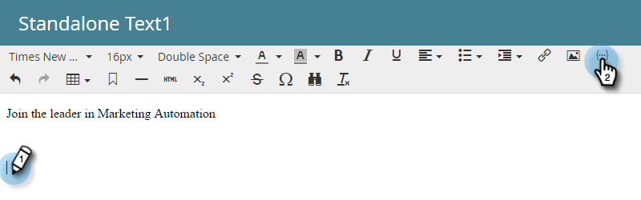
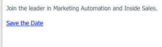

# 在電子郵件中加入行事曆事件 (.ics) {#include-a-calendar-event-ics-in-an-email}

行事曆檔案Token可讓您將行事曆事件(.ics)連結新增到您的Marketo電子郵件。

>[!PREREQUISITES]
>
>[建立行事曆事件(.ics)檔案](/help/marketo/product-docs/email-marketing/general/functions-in-the-editor/create-a-calendar-event-ics-file.md)

1. 編輯程式的電子郵件時，請按一下您要標籤的位置，然後按一下&#x200B;**插入標籤**&#x200B;按鈕。

1. 選取行事曆檔案權杖並按一下&#x200B;**[!UICONTROL Insert]**。

   

1. 按一下「**[!UICONTROL Save]**」。

   

   收件者會收到類似以下的電子郵件。

   

任務完成！
