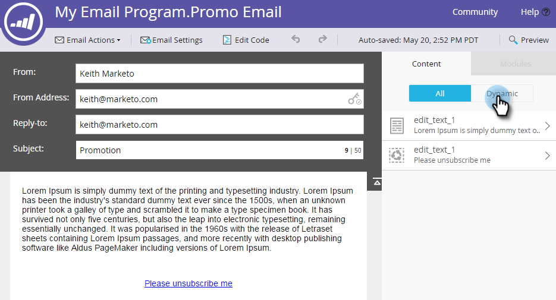

# 預覽包含動態內容的電子郵件 {#preview-an-email-with-dynamic-content}

新增動態內容後預覽您的電子郵件以進行驗證。

1. 選取您的電子郵件並按一下 **預覽電子郵件**.

   

1. 按一下「檢視依據」下拉式清單，然後選取您要預覽的動態內容型別。

   

1. 新的下拉式清單隨即顯示。 按一下並選擇特定內容。

   

1. 使用箭頭來捲動各個選項。

   

您也可以直接在電子郵件編輯器中預覽動態內容。

1. 在 **內容**，按一下 **動態** 標籤。

   

1. 按一下您要預覽的內容。

   

太棒了！ 預覽您的電子郵件，以確定內容如您所需。
