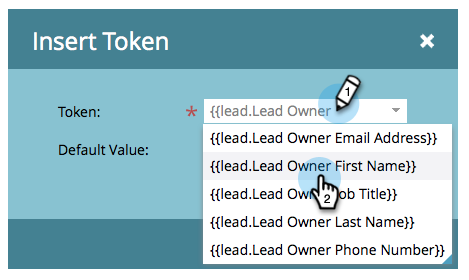
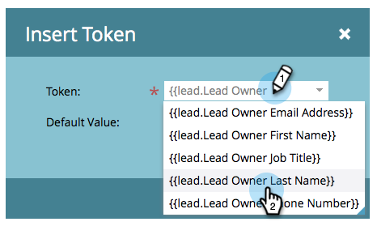

# 從銷售機會擁有者傳送電子郵件 {#send-emails-from-the-lead-owner}

如果您想代表銷售機會擁有者傳送電子郵件給銷售機會，該怎麼辦？  這是方法。

1. 找到您的電子郵件，選取它，然後按一下 **編輯草稿**.

   

1. 按一下 **從** 欄位（刪除任何現有名稱），然後按一下 **插入代號** 按鈕。

   

1. 開始鍵入&quot;`{{lead.Lead Owner`，然後選取 **`{{lead.Lead Owner First Name}}`** 代號。

   

1. 輸入預設值，以備銷售機會尚未擁有銷售機會所有者時使用 **插入**.

   

1. 按一下第一個代號之後，新增空格，然後按一下 **插入代號** 按鈕。

   

1. 開始鍵入&quot;`{{lead.Lead Owner`，然後選取 **`{{lead.Lead Owner Last Name}}`** 代號。

   

1. 輸入預設值，以備銷售機會尚未擁有銷售機會所有者時使用 **插入**.

   

   >[!TIP]
   >
   >請務必在名字代號和姓氏代號之間新增空格。

1. 按一下「寄件者電子郵件」欄位（刪除任何現有的電子郵件地址），然後按一下「插入代號」按鈕。

   

1. 開始鍵入&quot;`{{lead.Lead Owner`，然後選取 **`{{lead.Lead Owner Email Address}}`** 代號。

   

1. 輸入預設值，以備銷售機會尚未擁有銷售機會所有者時使用 **插入**.

   

1. 請確定 **回覆** 和 **主旨** 欄位已填入，您就完成了！

   
