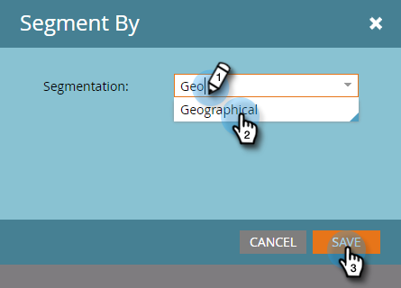
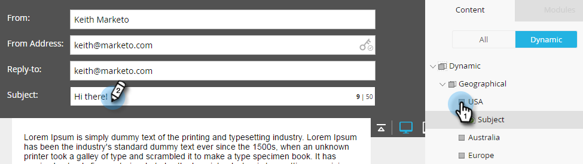

# 在電子郵件中使用動態內容 {#using-dynamic-content-in-an-email}

>[!PREREQUISITES]
>
>[建立分段](/help/marketo/product-docs/personalization/segmentation-and-snippets/segmentation/create-a-segmentation.md)

使用電子郵件中的動態內容發送您的線索目標資訊。

>[!NOTE]
>
>只有在使用「觸發市場活動」時，才支援在電子郵件中動態內容中使用變數。 是 **不** 使用批市場活動時支援。

## 添加分段 {#add-segmentation}

1. 轉到 **營銷活動**。

   

1. 選擇您的電子郵件，然後按一下 **編輯草稿**。

   

1. 在本例中，我們使主題線動態。 在「Subject（主題）」欄位中按一下，然後按一下 **動態** 按鈕

   

   >[!NOTE]
   >
   >您還可以使電子郵件中的元素動態。 為此，請選取區域，按一下齒輪表徵圖，然後選取 **動態** 或 [替換為代碼段](/help/marketo/product-docs/personalization/segmentation-and-snippets/snippets/create-a-snippet.md)取決於你在做什麼)。

1. 輸入分段名稱，選擇它，然後按一下 **保存**。

   

   分割及其段顯示在右側的「動態」(Dynamic)頁籤下。

   

## 應用動態內容 {#apply-dynamic-content}

>[!CAUTION]
>
>允許的動態內容元素數量不是無限的。 雖然沒有特定的數量限制（可能因內容組合而有所不同），但過度使用動態內容可能會對電子郵件的效能產生負面影響。 我們建議將每封電子郵件使用的動態內容元素數量保持在20以下。

1. 按一下段並添加主題行。

1. 對每個段重複。

   

>[!TIP]
>
>在將內容應用到各個段之前建立預設電子郵件。

>[!CAUTION]
>
>對預設段內容塊所做的更改將應用於所有段。

真貼心！ 現在，您可以向目標受眾發送靈活的電子郵件。

>[!MORELIKETHIS]
>
>* [預覽包含動態內容的電子郵件](/help/marketo/product-docs/email-marketing/general/functions-in-the-editor/preview-an-email-with-dynamic-content.md)
>* [在登錄頁中使用動態內容](/help/marketo/product-docs/demand-generation/landing-pages/free-form-landing-pages/use-dynamic-content-in-a-free-form-landing-page.md)

