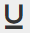
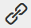

# 使用富格文本編輯器{#using-the-rich-text-editor}

Rich Text Editor(RTE)會出現在整個Marketo中，而且可在您想要新增或編輯內容時使用。 您會在登陸頁面、程式、電子郵件、表格和程式碼片段上看到其版本。 只要按一下「編輯草稿」(Edit Draft)，它就會快顯並提供服務。****

## 編輯器設定{#editor-settings}

根區塊元素設定會定義哪些標籤包覆您的內容。 依預設，電子郵件根區塊元素會使用`
`標籤。 您可以選擇依照下列步驟來變更。

>[!TIP]
>
>雖然您可以選擇根區塊元素，但我們一律建議使用預設設定來提供最佳的使用者體驗。

1. 按一下&#x200B;**管理**。

   

1. 按一下&#x200B;**電子郵件**。

   

1. 按一下「編輯文字編輯器設定&#x200B;**」。**

   

1. 在&#x200B;**電子郵件／程式碼片段編輯器**&#x200B;下拉式清單中，選取`
`或「無」，然後按一下「儲存&#x200B;****」。 `
` 在此示例中使用。

   

   如果您在「電子郵件範本」中有`

`，當您在編輯器中開啟區段並輸入「Text Goes Here」時，會看到下列HTML來源行為：

<table> 
 <tbody> 
  <tr> 
   <th>&lt;p&gt;</th> 
   <th>&lt;div&gt;</th> 
   <th>無</th> 
  </tr> 
  <tr> 
   <td>
&lt;div class="“mktEditable”"&gt; &lt;p&gt;Text Goes Here&lt;/p&gt; &lt;/div&gt;
</td> 
   <td>
&lt;div class="“mktEditable”"&gt; &lt;div&gt;Text Goes Here&lt;/div&gt; &lt;/div&gt;
</td> 
   <td>
&lt;div class="“mktEditable”"&gt; Text Goes Here &lt;/div&gt;
</td> 
  </tr> 
 </tbody> 
</table>

>[!TIP]
>
>您也可以依照相同的步驟變更著陸頁面編輯器的根區塊元素，但是按一下步驟4中的&#x200B;**著陸頁面編輯器**&#x200B;下拉式清單，而非電子郵件／程式碼片段編輯器。

>[!NOTE]
>
>rich-text program Token的根區塊元素一律為`
`。

## 功能{#features}

以下是您在RTE中可找到的功能。

| 表徵圖 | 名稱 | 它的功能 |
|---|---|---|
|  | 字型系列 | 選擇您的風格——我們有很多！ |
|  | 字型大小 | 你想要多大？ 25種選擇，從8像素到90像素。 |
|  | 樣式 | 選擇「段落」或6種「標題」樣式（用於著陸頁面）。 |
|  | 行距 | 選取線段之間的距離。 |
|  | 文字色彩 | 黑色，紅色，或是你想要的。 |
|  | 背景顏色 | 強調強調。 |
|  | 粗體 | **較深且較厚**。 |
|  | 斜體 | *傾斜，以強調或引*&#x200B;言。 |
|  | 下划線 | 在文字下放一行。 |
|  | 對齊方式 | 使用此下拉式清單來排版您的文字和影像。 將它們置中、選擇左對齊或右對齊，或使用完全對齊方式將它邊沿擴展至邊沿。 |  |  | 清單 | 從下拉式清單中選擇項目符號或數字。 項目符號適用於清單和含步驟的數字。 |
|  | 縮進 | 選擇更多或更少縮進。 用於段落或任何您想要脫穎而出的文字。 |
|  | 插入／編輯連結 | 加入網站或其他內容的連結；輕鬆進行變更。 |
|  | 插入／編輯影像 | 一張畫值千言萬語。 放一個。 按一下相機圖示以瀏覽您的Design Studio。 您可以並排放影像。 |
|  | 插入Token | 強大的工具，非常適合電子郵件個人化和資料追蹤。 請務必輸入預設值。 |
|  | 還原 | 糟了！ 讓你回到前面，再試一次。 |
|  | 重做 | 如果真的沒問題，請回到原版。 |
|  | 表格 | 像這樣，打造自己的作品。 下拉式選單可讓您設定它。 |
|  | 插入錨點 | 放下錨！ |
|  | 水準線 | 多種用途——非常適合分割區段。 |
|  | 編輯HTML | 彈出HTML原始碼編輯器，以便調整代碼。 |
|  | 訂閱 | 低掛字母（如O`2`中）。 |
|  | 上標 | 你有能力！ (2`6`)。 |
|  | 刪除線 | `<s>Put a line through text, like this</s>`. |
|  | 特殊字元 | 想談談歐元嗎？ 數學？ 你有243個選擇。 |
|  | 尋找和取代 | 搜尋和變更事項的速度比自己尋找每個執行個體來得快。 |
|  | 清除格式 | 讓一切回歸標準。 |
|  | 取消 | 按下按鈕說，「沒關係。」 |
|  | 儲存 | 按下按鈕說，「好，我喜歡。」 |

>[!TIP]
>
>您可以在不同的螢幕上編輯HTML和文字。 請務必在&#x200B;**Text**&#x200B;標籤上按一下&#x200B;**從HTML**&#x200B;複製，然後按一下&#x200B;**儲存**，讓您的文字元合您的HTML。

>[!NOTE]
>
>下拉式清單中不限於字型。 您可以存取HTML程式碼，使用未列出的程式碼。 Marketo支援所有網頁字型，但網頁字型並非所有電子郵件用戶端都適用。

## 著陸頁面{#landing-pages}

根區塊元素設定會定義哪些標籤包覆您的內容。 依預設，著陸頁面根區塊元素會使用`
`標籤。 您可以選擇依照下列步驟來變更。

>[!TIP]
>
>雖然您可以選擇根區塊元素，但我們一律建議使用預設設定來提供最佳的使用者體驗。

1. 按一下&#x200B;**管理**。

   

1. 按一下&#x200B;**電子郵件**。

   

1. 按一下「編輯文字編輯器設定&#x200B;**」。**

   

1. 在&#x200B;**著陸頁面編輯器**&#x200B;下拉式清單中，選取`
`或「無」，然後按一下「儲存&#x200B;**」。**`
` 在此示例中使用。

   

   就這樣！
