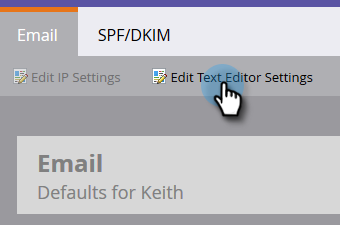
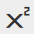

# 使用RTF編輯器 {#using-the-rich-text-editor}

RTF編輯器(RTE)會出現在整個Marketo中，而且只要您想要新增或編輯內容，隨時都可使用。 您會在登陸頁面、程式、電子郵件、表單和程式碼片段上看到其版本。 只需按一下 **編輯草稿**，系統會隨即彈出，為您服務。

## 編輯器設定 {#editor-settings}

根區塊元素設定會定義要將內容包裝在哪些標籤內。 依預設，電子郵件根區塊元素會使用 `
` 標籤之間。 您可選擇依照下列步驟變更此設定。

>[!TIP]
>
>雖然您可以選擇根區塊元素，但我們一律建議您使用預設設定以獲得最佳的使用者體驗。

1. 按一下 **管理員**.

   

1. 按一下 **電子郵件**.

   

1. 按一下 **編輯文字編輯器設定**.

   

1. 在 **電子郵件/代碼片段編輯器** 下拉式清單，選取 `
` 或無並按一下 **儲存**. `
` 在此範例中使用。

   

   如果您有 `

` 在電子郵件範本中，當您開啟區段並在編輯器中輸入「文字移至此處」時，將會看到下列HTML來源行為：

<table> 
 <tbody> 
  <tr> 
   <th>&lt;p&gt;</th> 
   <th>&lt;div&gt;</th> 
   <th>無</th> 
  </tr> 
  <tr> 
   <td>
&lt;div class="“mktEditable”"&gt; &lt;p&gt;文字移至此處&lt;/p&gt; &lt;/div&gt;
</td> 
   <td>
&lt;div class="“mktEditable”"&gt; &lt;div&gt;文字移至此處&lt;/div&gt; &lt;/div&gt;
</td> 
   <td>
&lt;div class="“mktEditable”"&gt; 文字移至此處 &lt;/div&gt;
</td> 
  </tr> 
 </tbody> 
</table>

>[!TIP]
>
>您也可以按照相同的步驟變更「登入頁面編輯器」的根區塊元素，但按一下 **登陸頁面編輯器** 步驟4中的下拉式清單，而非電子郵件/代碼片段編輯器。

>[!NOTE]
>
>根區塊元素一律為 `
` 適用於RTF文字程式Token。

## 功能 {#features}

以下是您在RTE中可以找到的功能。

| 圖示 | 名稱 | 作用 |
|---|---|---|
|  | 字型系列 | 選擇您的風格 — 我們有足夠的！ |
|  | 字型大小 | 您想要多大？ 25種選擇，從8px到90px。 |
|  | 樣式 | 選擇「段落」或6種標題樣式（適用於登陸頁面）。 |
|  | 行距 | 選取直線之間的距離。 |
|  | 文字色彩 | 黑色、紅色或您想要的任何顏色。 |
|  | 背景顏色 | 強調顯示。 |
|  | 粗體 | **較深且較厚**. |
|  | 斜體 | *帶角，用於強調或引用* s. |
|  | 加底線 | 在文字下方加上一行。 |
|  | 對齊方式 | 使用此下拉式清單來配置文字和影像。 置中對齊、選擇靠左或靠右對齊，或以完全齊行的方式將對齊範圍從邊緣擴展至邊緣。 |  |  | 清單 | 從下拉式選單中選擇專案符號或數字。 專案符號很適合包含清單和步驟的數字。 |
|  | 縮排 | 選擇或多或少的縮排。 用於段落或您要突顯的任何文字。 |
|  | 插入/編輯連結 | 放入網站或其他內容的連結；輕鬆進行變更。 |
|  | 插入/編輯影像 | 圖片值千言萬語。 放入。 按一下相機圖示以瀏覽您的Design Studio。 您可以並排放置影像。 |
|  | 插入Token | 功能強大的工具，適用於電子郵件個人化和資料追蹤。 請務必輸入預設值。 |
|  | 還原 | 糟糕！ 請回到上一步，然後再試一次。 |
|  | 取消復原 | 如果確實沒問題，請回到原始狀態。 |
|  | 表格 | 建置您自己的檔案，例如這個。 下拉式功能表可讓您進行設定。 |
|  | 插入錨點 | 放置錨點！ |
|  | 水平線 | 許多用途 — 很適合分割區段。 |
|  | 編輯HTML | 彈出HTML原始碼編輯器，讓您調整程式碼。 |
|  | 下標 | 低懸字母(如O`2`)。 |
|  | 上標 | 您擁有強大的功能！ (2`6`). |
|  | 刪除線 | `<s>Put a line through text, like this</s>`. |
|  | 特殊字元 | 想談談歐元嗎？ 數學？ 您有243種選擇。 |
|  | 尋找和取代 | 搜尋和變更專案的速度，會比自行尋找每個執行個體快得多。 |
|  | 清除格式 | 將專案恢復為標準。 |
|  | 取消 | 按下按鈕說：「不要緊。」 |
|  | 儲存 | 按下按鈕說：「OK， I like it.」 |

>[!TIP]
>
>您可以在個別的熒幕上編輯HTML和文字。 請務必按一下 **從HTML複製** 於 **文字** 標籤然後 **儲存** 讓文字與您的HTML相符。

>[!NOTE]
>
>下拉式清單中的字型不受限制。 您可以存取HTML程式碼，以使用未列出的程式碼。 Marketo支援所有Web字型，但Web字型並非在所有電子郵件使用者端都適用。

## 登陸頁面 {#landing-pages}

根區塊元素設定會定義要將內容包裝在哪些標籤內。 根據預設，登入頁面根區塊元素會使用 `
` 標籤之間。 您可選擇依照下列步驟變更此設定。

>[!TIP]
>
>雖然您可以選擇根區塊元素，但我們一律建議您使用預設設定以獲得最佳的使用者體驗。

1. 按一下 **管理員**.

   

1. 按一下 **電子郵件**.

   

1. 按一下 **編輯文字編輯器設定**.

   

1. 在 **登陸頁面編輯器** 下拉式清單，選取 `
` 或無並按一下 **儲存**. `
` 在此範例中使用。

   

   就是這樣！
