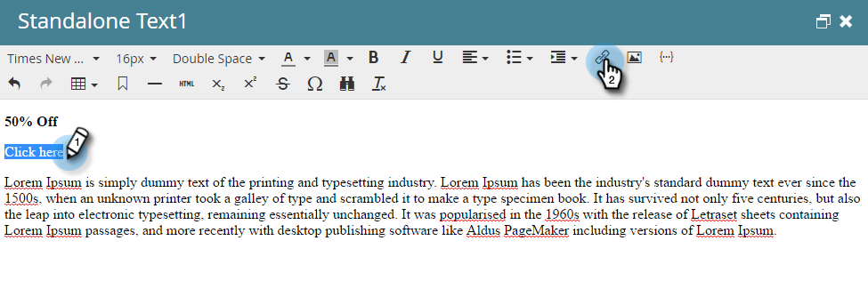

# 新增權杖至電子郵件連結 {#add-tokens-to-an-email-link}

若要在連結中插入額外和個人特定引數，您可以使用代號。 方法如下。

1. 選取您的電子郵件，然後按一下「**[!UICONTROL Edit Draft]**」標籤。

   

1. 連按兩下可編輯區域。

   

1. 尋找或寫入連結的文字。 反白顯示，然後按一下&#x200B;**[!UICONTROL Insert/Edit Link]**&#x200B;圖示。

   

1. 在&#x200B;**[!UICONTROL URL]**&#x200B;中輸入所需的權杖，然後按一下&#x200B;**[!UICONTROL Insert]**。

   

1. 按一下「**[!UICONTROL Save]**」。

   

>[!MORELIKETHIS]
>
>[在我的Token中使用URL](/help/marketo/product-docs/email-marketing/general/using-tokens/using-urls-in-my-tokens.md)
