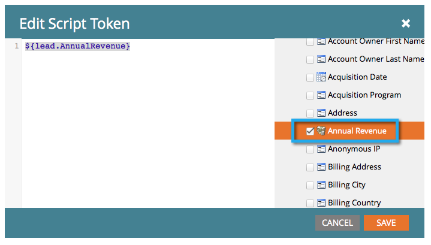

# 建立電子郵件指令碼Token {#create-an-email-script-token}

對於進階開發人員，您可以使用 [Velocity指令碼](https://velocity.apache.org/engine/1.7/user-guide.html) 在電子郵件中。 這是怎麼做的。

1. 前往 **行銷活動**.

   

1. 查找並選擇任何方案（事件、預設或參與等）。

   

1. 在 **我的代號** 標籤 **電子郵件指令碼** 代號。

   

1. 為您的電子郵件指令碼Token命名，並 **按一下「編輯」** 其內容。

   

1. 使用右側的樹來拖入 **人員，機會**，或 **自訂物件** 代號。

   

   >[!NOTE]
   >
   >訪問陣列（機會或自定義對象）時，您只能訪問與該人員關聯的最近10個項目。

1. 請注意，將代號拖曳至指令碼編輯器後，代號會變成勾選/使用中。

   

   >[!NOTE]
   >
   >如果您輸入自由格式的代號，請確定檢查/啟用樹狀結構中所有對應的代號，否則這些代號將被視為純文字，將無法運作。

1. 將指令碼寫入Velocity。 以下是一些實用資源：

   * [Marketo開發人員電子郵件指令碼檔案](https://developers.marketo.com/email-scripting/)
   * [Velocity使用手冊](https://velocity.apache.org/engine/devel/user-guide.html)
   * [Velocity參考指南](https://velocity.apache.org/engine/devel/vtl-reference-guide.html)
   * [Velocity工具Javadoc](https://velocity.apache.org/tools/releases/2.0/javadoc/index.html)

1. 指令碼完成後，按一下 **儲存**.

   

1. 按一下 **儲存** 再來一次。

   

現在，您可以在電子郵件中使用此代號。 每次傳送電子郵件時，都會執行指令碼。

>[!MORELIKETHIS]
>
>[將電子郵件指令碼Token新增至您的電子郵件](/help/marketo/product-docs/email-marketing/general/using-tokens/add-an-email-script-token-to-your-email.md)
