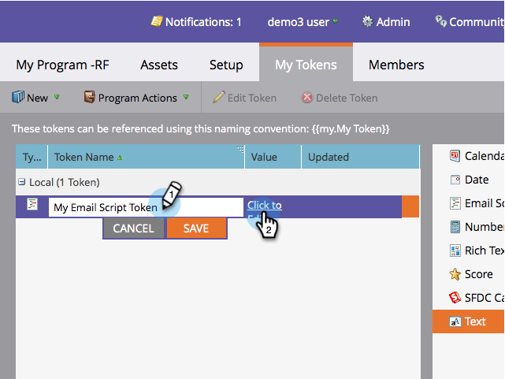

# 建立電子郵件指令碼Token {#create-an-email-script-token}

對於進階開發人員，您可以使用 [Velocity指令碼](https://velocity.apache.org/engine/1.7/user-guide.html) 在電子郵件中。 以下是其操作方式。

1. 前往 **行銷活動**.

   

1. 尋找並選取任何計畫（事件、預設或參與等）。

   

1. 在 **我的Token** 標籤，拖入 **電子郵件指令碼** Token。

   

1. 為您的電子郵件指令碼Token命名並 **按一下以編輯** 其內容。

   

1. 使用右側的樹狀結構以拖入 **個人、機會**，或 **自訂物件** Token。

   

   >[!NOTE]
   >
   >存取陣列（機會或自訂物件）時，您被限製為與個人相關聯的最近10個專案。

1. 請注意，將權杖拖曳至指令碼編輯器後，權杖會變成已核取/作用中。

   

   >[!NOTE]
   >
   >如果您以自由格式輸入權杖，請確定檢查/啟動樹狀結構中所有對應的權杖，否則系統會將它們視為純文字且無法運作。

1. 在Velocity中撰寫指令碼。 以下是一些實用的資源：

   * [Marketo開發人員電子郵件指令碼檔案](https://developers.marketo.com/email-scripting/)
   * [Velocity使用手冊](https://velocity.apache.org/engine/devel/user-guide.html)
   * [Velocity參考指南](https://velocity.apache.org/engine/devel/vtl-reference-guide.html)
   * [Velocity Tools Javadoc](https://velocity.apache.org/tools/releases/2.0/javadoc/index.html)

1. 指令碼完成後，請按一下 **儲存**.

   

1. 按一下 **儲存** 再來一次。

   

現在您可以在電子郵件中使用此Token。 它會在每次傳送電子郵件時執行指令碼。

>[!MORELIKETHIS]
>
>[新增電子郵件指令碼Token至您的電子郵件](/help/marketo/product-docs/email-marketing/general/using-tokens/add-an-email-script-token-to-your-email.md)
