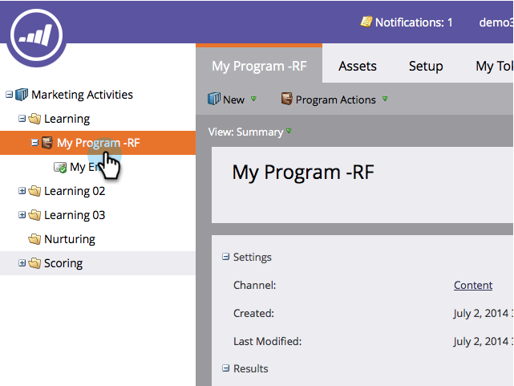

# 建立電子郵件指令碼Token {#create-an-email-script-token}

對於進階開發人員，您可以在電子郵件中使用[Velocity指令碼](http://velocity.apache.org/engine/1.7/user-guide.html)。 這是如何做到的。

1. 前往&#x200B;**行銷活動**。

   

1. 尋找並選取任何方案（事件、預設或參與等）。

   

1. 在&#x200B;**我的Token**&#x200B;標籤下，拖曳&#x200B;**電子郵件指令碼** Token。

   

1. 為您的電子郵件指令碼Token命名，然後按一下以編輯&#x200B;**其內容。**

   

1. 使用右側的樹可以拖動&#x200B;**Person、Opportunity**&#x200B;或&#x200B;**Custom Object**&#x200B;標籤。

   

   >[!NOTE]
   >
   >訪問陣列（業務機會或自定義對象）時，您只能訪問與該人員關聯的最近10個項目。

1. 請注意，將Token拖曳至指令碼編輯器後，Token會變為勾選／作用中。

   

   >[!NOTE]
   >
   >**提醒**
   >
   >
   >如果您輸入Token自由格式，請確定檢查／啟用樹狀結構中所有對應的Token，否則這些Token將被視為純文字而無法運作。

1. 以Velocity編寫您的指令碼。 以下是一些有用的資源：

   * [行銷人員電子郵件指令碼檔案](http://developers.marketo.com/email-scripting/)
   * [Velocity使用指南](http://velocity.apache.org/engine/devel/user-guide.html)
   * [速度參考指南](http://velocity.apache.org/engine/devel/vtl-reference-guide.html)
   * [Velocity工具Javadoc](http://velocity.apache.org/tools/releases/2.0/javadoc/index.html)

1. 指令碼完成後，按一下&#x200B;**保存**。

   

1. 再按一下一次「保存」。****

   

現在，您可以在電子郵件中使用此Token。 每次傳送電子郵件時，都會執行指令碼。

>[!MORELIKETHIS]
>
>* [將電子郵件指令碼Token新增至您的電子郵件](add-an-email-script-token-to-your-email.md)

>

