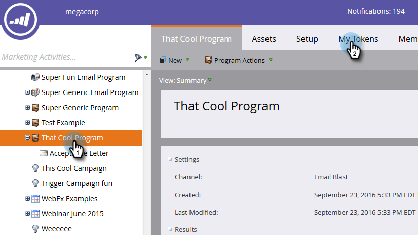

# 在我的Token中使用URL {#using-urls-in-my-tokens}

請依照下列步驟，使用「我的代號」將URL插入您的電子郵件。

1. 選取您的程式並按一下 **我的Token**.

   

1. 選取 **文字** 我的Token，將其拖放到畫布上。

   

1. 為權杖指定唯一名稱，輸入URL (不含https://)並按一下 **儲存**.

   

   >[!CAUTION]
   >
   >若要確保在您的電子郵件中追蹤點按，請執行 **非** 在Token的值內輸入https:// 。

1. 在您的程式中選取電子郵件。

   

1. 按一下 **編輯草稿**.

   

1. 在文字區域中連按兩下以編輯。

   

1. 在電子郵件中的任一處，輸入「https://」（後面不留空格）並按一下「插入Token」圖示。

   

   >[!NOTE]
   >
   >如果您的網站使用「https」，您當然也可以選擇輸入。

1. 找到您的「我的Token」，選取它，然後按一下 **插入**.

   

1. 反白顯示https://和Token，然後按Ctrl/Cmd+X (Ctrl = Windows/Cmd = Mac)以剪下文字。

   

1. 反白您要顯示連結的文字，然後按一下插入/編輯連結圖示。

   

1. 按Ctrl/Cmd+V將內容貼到 **URL** 方塊並按一下 **插入**.

   

1. 按一下 **儲存**.

   

   而您已完成！ 您的URL將在傳送後填入，由於您將https://放在權杖前，它會產生可追蹤連結。
