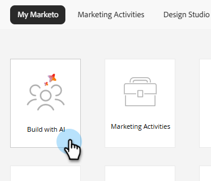

# 程式QA {#program-qa}

稽核您的方案，以獲得所有元件（例如電子郵件、登陸頁面、行銷活動等）的最佳實務。

>[!NOTE]
>
>此功能處於開放Beta版中，目前正在未來幾個月內分階段推出。 當您在「我的Marketo」畫面上看到&#x200B;_使用AI的建置_&#x200B;圖磚，就會知道您的訂閱已啟用此功能。

## 使用方式 {#how-to-use}

1. 在「我的Marketo」中，按一下「**使用AI建置**」圖磚。

   

1. 選取&#x200B;**程式QA**&#x200B;代理程式。

   

   系統會將您帶往對話式AI畫面。

1. 在右窗格中選取您要QA的程式。

   {width="800" zoomable="yes"}

   計畫的摘要會顯示在中央窗格中，提供計畫的概覽。

   {width="450" zoomable="yes"}

1. 在提示視窗中，輸入[QA程式]並按一下[傳送]。****

   

   AI助理提供所選程式的QA，向您顯示通過和未通過的專案。

   

<!--
   You have three validation paths to choose from:

   | Path | What You Provide | Verification Type | Best For |
   | --- | --- | --- | --- |
   | Rules Only | Nothing | Compliance checks | Org compliance & audits |
   | + Test Plan | Your team's test document | Rules + Custom checks | Team or channel-specific checks |
   | + Campaign Brief | Campaign brief document | Exact field matching | Pre-launch readiness |

1. To Upload a Test Plan, a Campaign Brief, or both, click the upload icon, add your files and click **Send**. To proceed with rules only, enter "Proceed with Rules Only" in the prompt window and click **Send**. In this example, we are proceeding with rules only.

PICC

1. To start validation, click **Run QA Validation**.

PICC

1. The report generates. To see the full report, click View Full Report.

PICC

1. The report appears in the center console. Scroll down to view. You can also download the report via .docx file.

PICC
-->
