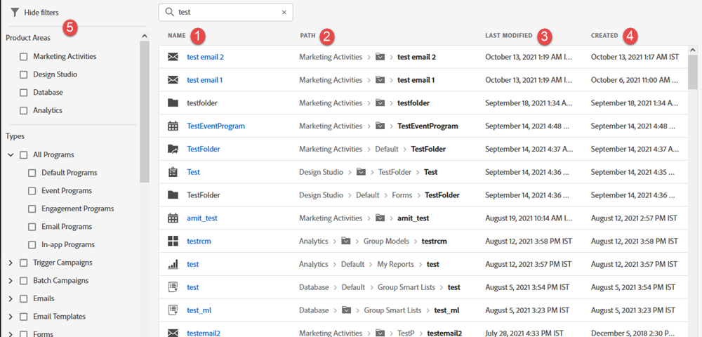

# 使用全域搜尋 {#using-the-global-search}

強大的全域搜尋為您提供許多選項，對顯示的結果沒有限制。

## 執行搜尋 {#performing-a-search}

1. 在「全域導覽」中，按一下搜尋圖示。

   

1. 輸入識別資產的文字。

   

1. 搜尋結果隨即顯示。 您可以在任何階層連結中按一下任何位置，直接帶到該專案。

   

1. 在此範例中，我們選取直接接收我們正在尋找的電子郵件。 按一下電子郵件的名稱。

   

系統會將您直接帶至所需的電子郵件。

## 搜尋結果頁面 {#search-results-page}

<table> 
 <tbody>
  <tr>
   <td>1</td> 
   <td>專案/目的地的名稱</td> 
  </tr>
  <tr>
   <td>2</td> 
   <td>前往個別專案/目的地的路徑（階層連結）</td> 
  </tr>
  <tr>
   <td>3</td> 
   <td>上次修改專案/目的地的日期和時間</td> 
  </tr>
  <tr>
   <td>4</td> 
   <td>建立專案/目的地的日期和時間</td> 
  </tr>
  <tr>
   <td>5</td> 
   <td>實作重點篩選條件以縮小搜尋結果</td> 
  </tr>
 </tbody>
</table>

**選擇性步驟**：若要使用篩選功能，只要選取您想要的選項即可。

