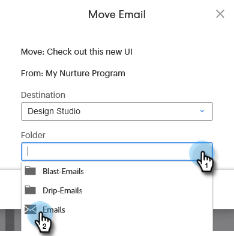

# 移動資產{#moving-assets}

拖放目前不提供，但您仍可輕鬆重新定位資產。

>[!NOTE]
>
>Design Studio中的檔案夾可在相同的工作區中移動，但目前無法跨工作區移動。

1. 在樹狀結構中，找出您要移動的資產。 按一下右鍵並選擇&#x200B;**移動**。

   

1. 選擇目標區域。

   

>[!NOTE]
>
>此模式中的後續選項可能會根據您選擇的&#x200B;**destination**&#x200B;而改變。

1. 選擇目標資料夾。

   

1. 按一下&#x200B;**移動**。

   

就是這麼簡單！
