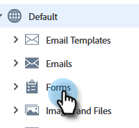

# 切換開關 {#toggle-switch}

切換開關允許您在Marketo的經典介面和下一代Marketo Engage體驗之間切換。 它可在下面所有突出顯示的區域使用。 從2022年5月發佈起，預設情況下將啟用新一代體驗。

>[!NOTE]
>
>選中「切換開關」後，所有現有工作流將在UI更改發生之前自動保存。 如果操作已在進行(例如：資產正在被批准)，您將收到一條錯誤消息，指示該資產，並應在操作完成後重試。

## 啟用單個角色的切換開關 {#enable-the-toggle-switch-for-individual-roles}

為單個角色或所有角色啟用切換開關。 這是方法。

1. 在Marketo Engage中，按一下 **管理**。

   

1. 按一下 **新體驗**。

   

1. 選擇要有權訪問切換開關的角色。

   

## 登錄頁清單視圖 {#landing-page-list-view}

下一代登錄頁清單視圖提供了搜索篩選器和執行成批登錄頁操作的能力。

1. 在Marketo，選擇 **設計工作室**。

   

1. 選擇 **登錄頁**。

   

1. 在頁面右下角，按一下 **新體驗** 切換。

   

新體驗將載入。

## 登錄頁詳細資訊視圖 {#landing-page-details-view}

1. 在Marketo，查找並選擇登錄頁。

   

1. 在頁面右下角，按一下 **新體驗** 切換。

   

新體驗將載入。

## 「表單詳細資訊」頁 {#form-details-page}

1. 在Marketo，查找並選擇您的表單。

   

1. 在頁面右下角，按一下 **新體驗** 切換。

   

新體驗將載入。

## 表單清單視圖 {#form-list-view}

1. 在Marketo，選擇 **設計工作室**。

   

1. 選擇 **Forms**。

   

1. 在頁面右下角，按一下 **新體驗** 切換。

   

新體驗將載入。

## 電子郵件模板詳細資訊視圖 {#email-template-details-view}

1. 在Marketo，選擇 **設計工作室**。

   

1. 選擇所需的電子郵件模板。

   

1. 在頁面右下角，按一下 **新體驗** 切換。

   

新體驗將載入。

## 電子郵件詳細資訊視圖 {#email-details-view}

1. 在Marketo，查找並選擇您的電子郵件。

   

1. 在頁面右下角，按一下 **新體驗** 切換。

   

新體驗將載入。

## 電子郵件清單視圖 {#email-list-view}

下一代電子郵件清單視圖提供了搜索過濾器和執行成批電子郵件操作的能力。

1. 在Marketo，選擇 **設計工作室**。

   

1. 選擇 **電子郵件**。

   

1. 在頁面右下角，按一下 **新體驗** 切換。

   

新體驗將載入。

## 啟用所有功能 {#enable-for-all-features}

您可以選擇手動啟用Marketo的下一代介面，以便獲得所有可用功能（當前和即將提供）。

1. 在當前具有切換開關的區域中(在本示例中，我們位於 [「表單詳細資訊」頁](#form-details-page))，按一下頁面右下角的齒輪表徵圖。

   

1. 選擇 **啟用所有可用功能** 按一下 **確定**。

   
