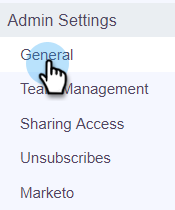

# 已封鎖的網域 {#blocked-domains}

防止您的銷售團隊不小心寄送電子郵件給競爭對手、已知的垃圾郵件陷阱，或任何其他您不想聯絡的網域，以協助他們取得成功。

>[!NOTE]
>
>**需要管理員權限**

1. 在網頁應用程式中，按一下齒輪圖示並選取&#x200B;**[!UICONTROL Settings]**。

   

1. 在[!UICONTROL Admin Settings]底下，按一下&#x200B;**[!UICONTROL General]**。

   

1. 輸入您要封鎖的網域，然後按一下&#x200B;**[!UICONTROL Block Domain]**。

   

   >[!NOTE]
   >
   >屬於[群組電子郵件](/help/marketo/product-docs/marketo-sales-connect/email/using-the-compose-window/sending-emails-via-group-email.md)傳送的電子郵件，若因傳送至封鎖的電子郵件網域而失敗，將會自動失敗，且不會出現在失敗的電子郵件資料夾中。
