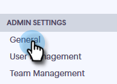

# 內容鎖定 {#content-lockdown}

透過啟用內容鎖定，限制非管理員使用者編輯範本和/或行銷活動。 使用者將無法：共用、複製、編輯或刪除內容。 他們也無法選擇封存範本。

>[!NOTE]
>
>使用者 **將** 仍然能夠在傳送時或啟動行銷活動時編輯電子郵件內容。

1. 在Sales Connect中，按一下設定圖示並選取 **設定**.

   

1. 在管理設定下，按一下 **一般**.

   

1. 向下捲動至「內容鎖定」。 開啟任一滑桿將 _disable_ 您的團隊成員建立/編輯範本和/或行銷活動的能力。

   
