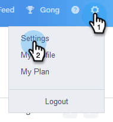
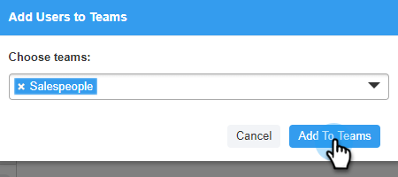

# 建立子團隊 {#create-a-sub-team}

## 建立子團隊 {#create-a-sub-team-1}

1. 按一下齒輪圖示並選取 **設定**.

   

1. 在「管理設定」下，選取 **團隊管理**.

   

1. 在「所有團隊」旁邊，按一下 **+**.

   

1. 輸入專案團隊名稱（和可選的說明），然後按一下 **建立**.

   

   >[!NOTE]
   >
   >您現在可以與該團隊共用範本、行銷活動和群組。

## 新增人員至您的子團隊 {#add-people-to-your-sub-team}

1. 仍然在「團隊管理」中，選取 **每個人** 群組。

   

1. 找到您要新增至子團隊的使用者，並選取其核取方塊。

   

1. 按一下 **將選取的專案新增至團隊**.

   

1. 按一下下拉式清單，然後選取您想要的團隊。

   

1. 按一下 **新增至團隊** 完成時。

   
