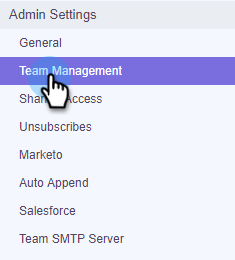

# 建立子團隊{#create-a-sub-team}

## 建立子團隊{#create-a-sub-team-1}

1. 按一下齒輪表徵圖並選擇「**設定**」。

   

1. 在「管理員設定」下，選取「團隊管理」**。**

   

1. 在「所有團隊」旁，按一下&#x200B;**+**。

   

1. 輸入團隊名稱（和可選說明），然後按一下&#x200B;**建立**。

   

   >[!NOTE]
   >
   >您現在可以與該團隊共用範本、促銷活動和群組。

## 將人員新增至您的子團隊{#add-people-to-your-sub-team}

1. 仍在「團隊管理」中，選擇&#x200B;**Everyone**&#x200B;組。

   

1. 找出您要新增至子團隊的使用者，並選取其核取方塊。

   

1. 按一下「將選取項目新增至團隊」**。**

   

1. 按一下下拉式清單，然後選取您想要的團隊。

   

1. 完成時，按一下「新增至團隊」。****

   
