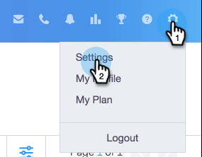
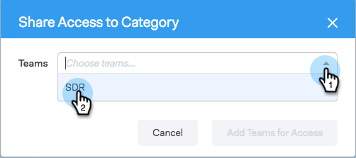
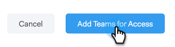

# 共用設定 {#sharing-settings}

透過限制使用者可以分享的內容以及與哪些類別來更好地管理您的範本。

第一次建立Sales Connect帳戶時，會啟用「共用設定」。 這可讓您的帳戶管理員在開啟閘門並允許使用者將內容分享至您的團隊類別之前，先建立並組織您的範本類別。

啟用「共用設定」時，除非提供共用許可權給團隊或所有人，否則只有管理員能夠共用至不同類別。 在「共用設定」停用時，沒有任何限制，所有使用者都可共用至任何範本類別中。

## 設定您的共用設定 {#configure-your-sharing-settings}

1. 在 [網頁應用程式](https://toutapp.com/login)，前往「設定」頁面。

   

1. 在管理設定下，選取 **共用存取權**.

   

1. 確定 **共用設定** 已啟用。 這表示在預設情況下，只有管理員可以在您的範本類別中共用範本。

   

1. 選取您要設定的範本類別。

   

1. 按一下 **新增團隊以存取**.

   

1. 選取您要新增的團隊。

   

   >[!NOTE]
   >
   >如果您沒有看到任何團隊，則需要前往「團隊管理」並建立使用者團隊。

1. 按一下 **新增團隊以存取** 以儲存。

   

1. 現在您的團隊已新增，您可以選取僅允許團隊管理員共用或該團隊中的所有使用者。 在此範例中，我們授予SDR團隊中的所有使用者共用存取權。

   
