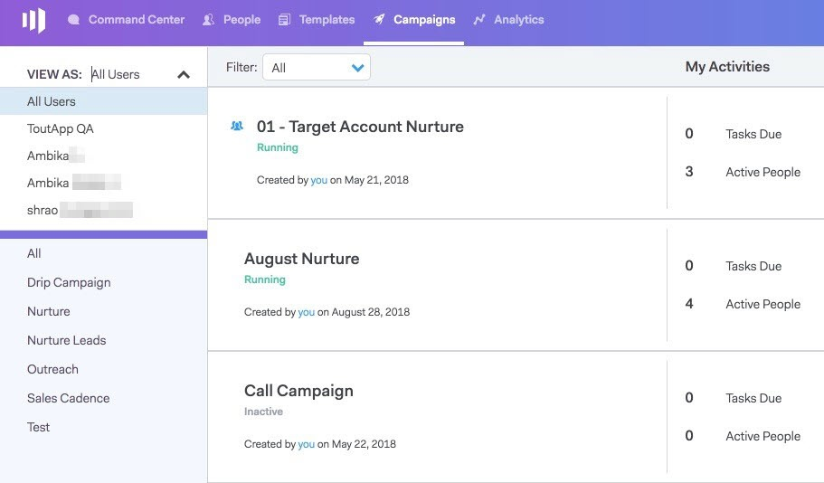

# 用戶訪問詳細資訊 {#user-access-details}

管理員和非管理員有權訪問哪些內容？

## 管理員用戶權限 {#admin-user-permissions}

管理員可以 [查看所有模板](/help/marketo/product-docs/marketo-sales-connect/templates/view-template-list-as-another-user.md)。

管理員可以 [查看所有市場活動](/help/marketo/product-docs/marketo-sales-connect/campaigns/view-campaigns-list-as-another-user.md)。

管理員可以查看所有電子郵件活動。

管理員可以查看正在運行的活動中的所有人員。

所有人員記錄都可以在「每個人」組中訪問。

管理員可以代表用戶停止市場活動。

## 非管理員用戶權限 {#non-admin-user-permissions}

* 分析：

   * 用戶可以查看團隊分析
   * 用戶可以只鑽取其所屬的團隊
   * 用戶可以查看自己的分析

* 「關係」頁：

   * 用戶可以與每個人共用組
   * 用戶可以僅與其所屬的團隊共用組
   * 刪除用戶後，其共用聯繫人會將所有權轉移給刪除該用戶的主管理員

* 銷售週期 — 下一和即時訂閱源：

   * 用戶可以查看「每個人」視圖
   * 用戶可以按其所屬的團隊進行篩選
   * 用戶可以與所有人共用帖子
   * 用戶只能與其所屬的團隊共用帖子

* 「團隊管理」頁：

   * 無法查看

* 模板頁：

   * 用戶可以與每個人共用模板
   * 用戶可以在管理員允許的類別中共用模板
   * 從團隊中刪除用戶時，其模板將與該團隊取消共用
   * 從團隊中刪除用戶時，其模板會將所有權轉移給刪除該用戶的主管理員
