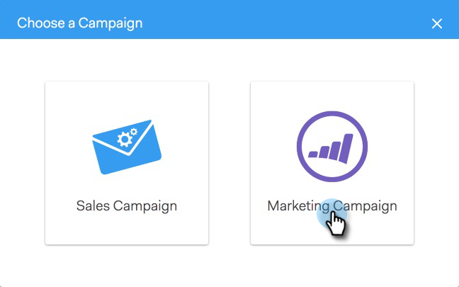

# 新增至行銷活動 {#add-to-marketing-campaign}

>[!PREREQUISITES]
>
>[讓銷售使用者看到行銷活動](/help/marketo/product-docs/marketo-sales-connect/marketo/make-a-campaign-visible-to-sales-connect-users.md)

## 將個人新增至行銷活動 {#add-individuals-to-a-campaign}

>[!NOTE]
>
>若要將個人從Sales Connect新增至Marketo Campaign，Sales Connect必須擁有個人的Marketo銷售機會ID。

1. 按一下 **人員** 標籤。

   

1. 尋找您要新增的連絡人。

   

1. 按一下核取方塊以選取您的連絡人。

   

1. 按一下 **新增選取專案至行銷活動**.

   

1. 由於您即將新增至行銷活動，請略過選取「寄件者」地址。 不過，您可以選擇新增更多連絡人。 如果您選擇這麼做，請按一下「個人」並輸入它們。 按一下 **下一個** 完成時。

   

1. 按一下 **行銷活動**.

   

1. 按一下「工作區」下拉式清單，然後選擇包含您要新增群組的行銷活動的工作區。

   

   >[!NOTE]
   >
   >如果您沒有看見想要的工作區，請確定您的管理員已透過您的Marketo團隊存取權頁面布建該工作區。

1. 選取所需的行銷活動，然後按一下 **下一個**.

   

1. 您會看到符合資格的連絡人。 按一下 **開始** 以將其新增。

   

## 將群組新增至行銷活動 {#add-a-group-to-a-campaign}

1. 按一下 **人員** 標籤。

   

1. 在「我的群組」下，選取您要新增至行銷活動的群組。

   

1. 按一下 **新增群組至行銷活動**.

   

1. 由於您即將新增至行銷活動，請略過選取「寄件者」地址。 不過，您可以選擇新增更多連絡人。 如果您選擇這麼做，請按一下「個人」並輸入它們。 按一下 **下一個** 完成時。

   

1. 選取 **行銷活動**.

   

   >[!NOTE]
   >
   >若要將個人從Sales Connect新增至Marketo Campaign，Sales Connect必須擁有個人的Marketo銷售機會ID。

1. 按一下「工作區」下拉式清單，然後選擇包含您要新增群組的行銷活動的工作區。

   

   >[!NOTE]
   >
   >如果您沒有看見想要的工作區，請確定您的管理員已透過您的Marketo團隊存取權頁面布建該工作區。

1. 選取所需的行銷活動，然後按一下 **下一個**.

   

1. 您會看到符合資格的連絡人。 按一下 **開始** 以將其新增。

   
