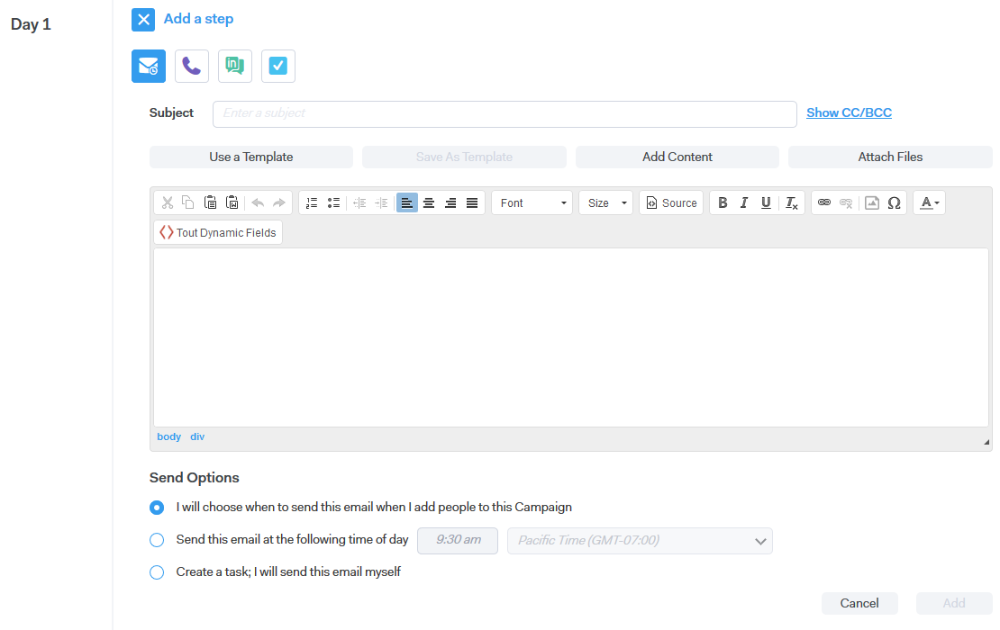
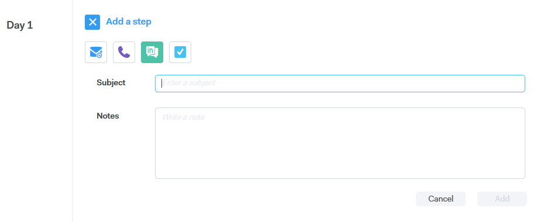

# 促銷活動步驟類型{#campaign-step-types}

新增步驟至促銷活動時，您有四個選項。

## 電子郵件{#email}

撰寫新電子郵件，或使用預先存在的範本。

| **使用範本** | 選擇您的其中一個預先存在的範本 |
|---|---|
| **另存為範本** | 將您剛撰寫的電子郵件儲存為新範本 |
| **新增內容** | 將檔案上傳至我們的伺服器，並收到可在您的電子郵件中追蹤的URL（指向內容） |
| **附加檔案** | 將檔案從您的電腦附加至電子郵件（大小限制為23MB） |

>[!TIP]
>
>瞭解有關[傳送選項](/help/marketo/product-docs/marketo-sales-connect/campaigns/understanding-send-options.md)的詳細資訊。

## 呼叫{#call}

設定提醒以透過電話追蹤連絡人。 您也可以儲存附註，以在呼叫期間用作通話追蹤。

## InMail {#inmail}

追蹤多個通道是與潛在客戶聯繫的絕佳方式。 有了InMail工作，您可以設定提醒以透過LinkedIn進行聯絡。

## 自定義任務{#custom-task}

當上述選項不適用時，請使用自訂工作。 例如，您可以邀請同事透過電子郵件追蹤銷售線索。

