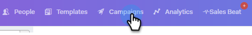

# 建立促銷活動 {#create-a-campaign}

促銷活動是一系列多管道步驟，包括：電子郵件、電話、InMail和自訂任務。 它們允許您簡化與潛在客戶和現有客戶的通信。

使用促銷活動，您可以：

* **組織**:將您的所有外聯活動集中到一個位置，以便高效執行。

* **規模**:排程所有外展工作，以便您能夠擴展工作規模、將手動工作減至最少，並根據需要進行個性化。
* **測量**:在將您的所有電子郵件和任務自動登入Salesforce時，在同一位置追蹤其成功。 通過了解產生共鳴和產生結果的原因，您可以始終測試並改進結果。

那麼，如何設定促銷活動？

1. 按一下 **行銷活動** 標籤。

   

1. 選取類別，然後按一下 **建立促銷活動** 按鈕，以建立新促銷活動。

   

   >[!NOTE]
   >
   >按一下 **+** 下一頁 **類別**.

1. 將選擇所選類別。 如果您改變心意，請按一下下拉式清單並選取其他下拉式清單。 完成後，按一下 **繼續**.

   

1. 按一下 **新增步驟**.

   

1. 在以下選項中選擇：電子郵件、呼叫、InMail或自訂任務。 在這個例子中，我們 [電子郵件](/help/marketo/product-docs/marketo-sales-connect/campaigns/campaign-step-types.md#email).

   

1. 在您建立第一天和步驟後，「添加日」按鈕將激活，您可以根據銷售流程的要求添加任意數量的天數和步驟。

   

   >[!NOTE]
   >
   >「天」不是動作之間的天數，而是序列中的某天。 例如，如果您的促銷活動將持續7天，輸入&#39;3&#39;表示動作將在第3天（共7天）進行， **not** 3天後。

1. 請務必自訂排程和回覆選項，例如瀏覽週末（這真是太棒了），方法是造訪 **設定標籤** 的Campaign。

   

   現在是開始為您的行銷活動新增人員的時候了！
