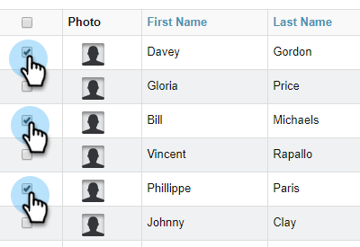

# 從促銷活動移除人員{#remove-people-from-a-campaign}

當收件者回覆時，您可以自動結束促銷活動。 此外，您可以選擇讓該促銷活動標示為該收件者的「成功」。

若要設定，在建立促銷活動後，只要勾選「促銷活動」標籤「設定」部分的「取消訂閱」方塊即可。 這兩個選項都會結束促銷活動，而您的收件者不會再收到您寄來的電子郵件。 您必須有回覆追蹤才能運作。

此外，您可以從促銷活動本身移除人員、從「人員」頁面的促銷活動移除人員，以及移除整組人員。 下面讓我們來看看以下三種方法。

## 直接從促銷活動移除人員{#remove-a-person-directly-from-a-campaign}

1. 在Sales Connect中，按一下&#x200B;**Campaigns**&#x200B;頁籤。

   

1. 尋找您的促銷活動並加以選取。

   

1. 您的促銷活動會出現在右側。 按一下其上的任何位置以開啟它。

   

1. 查找要刪除的人員，然後按一下&#x200B;**Remove**。

   

1. （可選步驟）您也可以按一下人名旁的核取方塊，然後按一下頂端的&#x200B;**移除**&#x200B;按鈕，一次移除多人。

   

## 從「人員」頁面{#remove-a-person-from-a-campaign-within-the-people-page}中的促銷活動移除人員

1. 在Sales Connect中，按一下&#x200B;**People**&#x200B;頁籤。

   

1. 查找並選擇要刪除的人員。

   

1. 其「人員詳細資料檢視」面板會在右側開啟。 按一下&#x200B;**History**&#x200B;頁籤，然後按一下&#x200B;**Remove**&#x200B;按鈕。

   

## 從促銷活動移除人員群組{#remove-a-group-of-people-from-a-campaign}

1. 在Sales Connect中，按一下&#x200B;**People**&#x200B;頁籤。

   

1. 在&#x200B;**我的群組**&#x200B;下尋找並選取您的群組。

   

1. 選擇要移除的人員。

   

1. 按一下「動作」****，然後選擇「移除從促銷活動選取的項目」**。**

   
