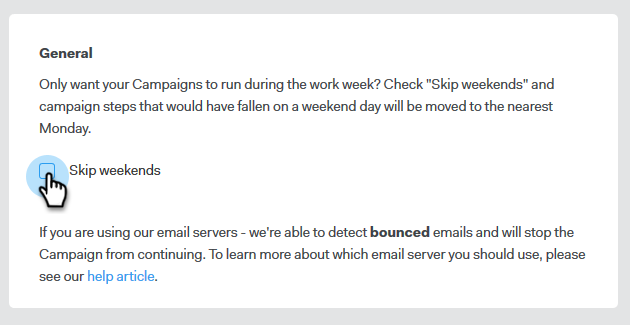

# 跳過週末 {#skip-weekends}

當行銷活動自動化時，您可能不希望您的電子郵件在星期六或星期日外寄。 如果沒有，您可以略過週末。

1. 在[!DNL Sales Connect]中，按一下&#x200B;**[!UICONTROL &#x200B; Campaigns]**&#x200B;標籤。

   

1. 找到並選取您的行銷活動。

   

1. 按一下「**[!UICONTROL Settings]**」。

   

1. 選取&#x200B;**[!UICONTROL Skip weekends]**&#x200B;核取方塊。

   

   >[!NOTE]
   >
   >若沒有略過週末，您的電子郵件就會按照一般7天一週排程。
