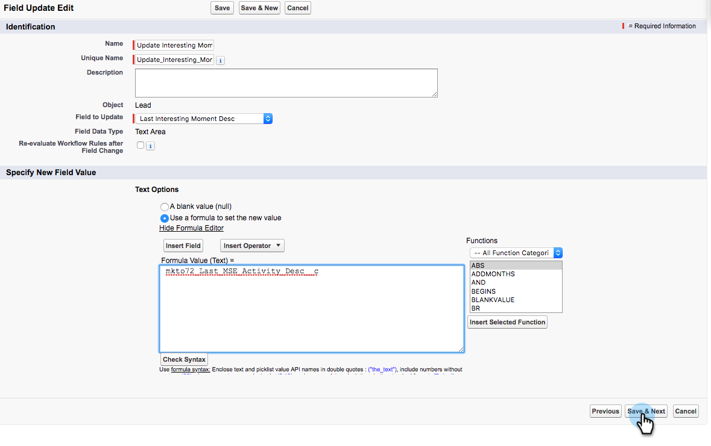

# 在Salesforce中建立工作流程規則 {#creating-workflow-rules-in-salesforce}

並行使用Marketo Sales Insight (MSI)和Marketo Sales Connect (MSC)時，Salesforce中的MSI最佳對策功能不會更新。 所有其他MSI功能都照常運作（在iFrame中檢視有趣的時刻、傳送電子郵件、新增促銷活動等）。 本文提供讓最佳賭注再次運作的因應措施。

>[!NOTE]
>
>這只會影響正在使用的客戶 **兩者** MSI和MSE，以及想要在MSI中使用最佳選擇功能的使用者。 如果您不需要/使用「首選」，可以忽略。

## 快速入門 {#getting-started}

因應措施包括建立新的工作流程規則，將新MSE欄位的值複製到舊MSI欄位。 您需要為Contact物件建立四個工作流程規則，並為您自己的Salesforce例項中的Lead物件建立相同的四個工作流程規則。 這可能需要您擁有CRM管理員許可權（視您在CRM中的角色和設定而定）。

以下是工作流程規則的建議名稱及各自的相關說明。 這些適用於Contact和Lead物件：

<table> 
 <colgroup> 
  <col> 
  <col> 
 </colgroup> 
 <tbody> 
  <tr> 
   <td>更新有趣的時刻描述欄位</td> 
   <td>
複製來源：上次Marketo參與說明 複製到：上一個有趣時刻說明
</td> 
  </tr> 
  <tr> 
   <td>更新有趣的時刻型別欄位</td> 
   <td>
複製來源：上次Marketo參與型別 複製到：上一個有趣的時刻型別
</td> 
  </tr> 
  <tr> 
   <td>更新有趣的時刻來源欄位</td> 
   <td>
複製來源：上次Marketo參與來源 複製到：上一個有趣的時刻來源
</td> 
  </tr> 
  <tr> 
   <td>更新有趣的時間日期欄位</td> 
   <td>
複製來源：上次Marketo參與日期 複製到：上一個有趣的時刻日期
</td> 
  </tr> 
 </tbody> 
</table>

## 指示 {#instructions}

1. 按一下 **設定**，搜尋 **工作流程** 並選取 **工作流程規則**.

   

1. 選取 **新規則**.

   

1. 按一下「物件」下拉式清單，然後選取 **銷售機會**，然後按一下 **下一個**.

   

1. 輸入「更新有趣的時刻描述欄位」作為規則名稱。 選取選項按鈕 **已建立，且每次編輯時**. 在「規則條件」下拉式清單中選取 **公式評估為true**. 搜尋並選取ISCHANGED函式。 然後，反白預設欄位值並按一下 **插入欄位**.

   

1. 在「插入欄位」快顯視窗中，選擇 **上次Marketo參與說明** 並按一下 **插入**.

   

1. 按一下 **儲存並下一步**.

   

1. 在「新增工作流程動作」下拉式清單中，選取 **新欄位更新**.

   

1. 在「名稱」欄位中，輸入「更新有趣的時刻描述欄位」（將自動產生唯一名稱）。 在「要更新的欄位」下拉式清單中，選擇 **上一個有趣時刻說明**. 選取 **使用公式來設定新值** 選項按鈕，然後按一下 **顯示公式編輯器**.

   

1. 按一下 **插入欄位** 按鈕。

   

1. 選取 **上次Marketo參與說明**，然後按一下 **插入**. 在下一頁，按一下 **儲存**.

   

1. 按一下 **完成**.

   

1. 按一下 **啟動** 以開啟工作流程規則。

   

   在最後一個步驟之後，您可以選擇複製「快速入門」段落中列出的其他欄位的工作流程規則：說明、型別、來源、日期。 完成Contact物件中的四個工作流程規則後，對Lead物件重複相同的動作。
