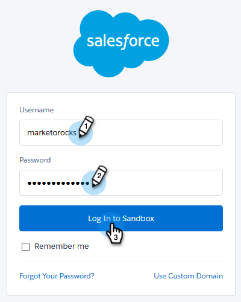

# 如何將 Sales Connect 連接至您的 Salesforce 沙箱 {#how-to-connect-sales-connect-to-your-salesforce-sandbox}

>[!PREREQUISITES]
>
>建立與沙箱的連線時，您的[!DNL  Sales Connect]帳戶無法連線到[!DNL Salesforce]。 如果是，[請確定您中斷連線](/help/marketo/product-docs/marketo-sales-connect/crm/salesforce-integration/disconnect-salesforce-from-your-sales-connect-account.md)，然後再依照本文中的步驟進行。

1. 在[!DNL Sales Connect]中，按一下右上方的齒輪圖示並選取&#x200B;**[!UICONTROL Settings]**。

   

1. 在[!UICONTROL Integrations]底下，按一下&#x200B;**[!UICONTROL CRM]**。

   

1. 在[!DNL Salesforce]卡片中，按一下&#x200B;**[!UICONTROL More Info]**。

   

1. 在頁面底部，按一下&#x200B;**[!UICONTROL Connect to Sandbox]**。

   

   >[!NOTE]
   >
   >如果您已登入您的[!DNL Salesforce Sandbox]帳戶，您將進入需要允許存取的授權頁面。 如果您尚未登入，請繼續進行步驟5。

1. 輸入您[!DNL Salesforce Sandbox]帳戶的使用者名稱和密碼。

   

>[!MORELIKETHIS]
>
>[如何在您的Salesforce沙箱中安裝自訂](/help/marketo/product-docs/marketo-sales-connect/crm/salesforce-customization/how-to-install-customizations-in-your-salesforce-sandbox.md)
