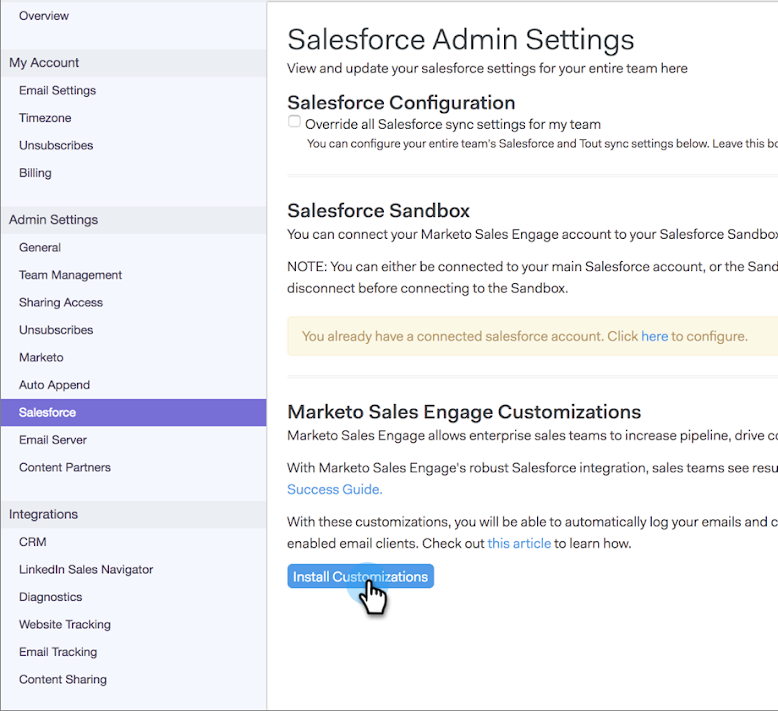

# 如何在您的Salesforce沙箱中安裝自訂 {#how-to-install-customizations-in-your-salesforce-sandbox}

>[!NOTE]
>
>**需要管理權限**

>[!PREREQUISITES]
>
>[將Sales Connect連接到您的Salesforce沙箱](/help/marketo/product-docs/marketo-sales-connect/crm/salesforce-customization/how-to-connect-sales-connect-to-your-salesforce-sandbox.md)

1. 在Sales Connect中，按一下右上角的齒輪表徵圖並選擇 **設定**.

   

1. 在「管理設定」下，按一下 **售貨員。**

   

1. 按一下 **安裝自定義**.

   

   接下來，您只需按照常規Salesforce帳戶的操作方式，完成安裝自定義項的步驟。
