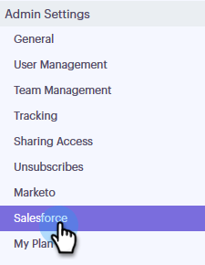

# 安裝適用於Professional Edition客戶的Salesforce Customization {#install-salesforce-customization-for-professional-edition-customers}

擁有Salesforce Professional Edition的客戶必須依照這些步驟安裝自訂。

>[!PREREQUISITES]
>
>* Sales Connect管理員必須連線其Salesforce和Sales Connect帳戶。
>* 使用的Salesforce執行個體需要空間來安裝十三個自訂活動欄位。

## 安裝 {#installation}

1. 在Sales Connect中，按一下右上方的齒輪圖示並選取 **設定**.

   

1. 在管理設定下，按一下 **Salesforce**.

   

1. 確認您已連線至您的Salesforce帳戶。

   >[!CAUTION]
   >
   >如果您已連線，則會看到綠色的「安裝」按鈕。 **不要** 按一下此按鈕，改為繼續執行步驟4。

1. 登入您連線的Salesforce帳戶，然後按一下 [此連結](https://login.salesforce.com/packaging/installPackage.apexp?p0=04t0b000001oWEZ).
1. 您將會被送到Sales Connect安裝頁面。

   

1. 選擇您要安裝自訂的使用者：僅限管理員、所有使用者或特定設定檔。
1. 按一下 **安裝** 按鈕以安裝自訂。
1. 若要確認安裝成功，請登入您的Salesforce帳戶。
1. 按一下 **設定**，在搜尋列中搜尋「已安裝的套件」，然後按一下 **已安裝的封裝**.

   您會在該處看到Marketo Sales Connect自訂。

   若要在Salesforce執行個體中設定Sales Connect，請依照《安裝指南》第7頁的「設定SALES ENGAGE SALESFORCE套件」一節中所述的步驟操作。

   >[!NOTE]
   >
   >Sales Engage是先前的Sales Connect名稱。

## 指南 {#guides}

[Salesforce Classic安裝指南](https://s3.amazonaws.com/tout-user-store/salesforce/assets/Marketo+Sales+Engage+For+Salesforce_+Installation+and+Success+Guide.pdf)

[Salesforce Lightning安裝指南](https://s3.amazonaws.com/tout-user-store/salesforce/assets/SF+Guide+for+Lightning.pdf)
