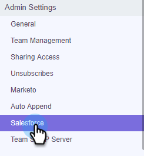

# CRM的銷售連接定制{#sales-connect-customizations-for-crm}

以下欄位和按鈕是由Salesforce CRM中的中繼資料API建立。 在建立欄位後，管理員必須在其CRM中設定頁面配置，才能公開這些版面。 您可在[這裡](https://docs.marketo.com/display/docs/assets/marketo-sales-engage-for-salesforce-installation-and-success-guide.pdf)找到說明。

>[!NOTE]
>
>這會影響ToutApp和Sales Connect客戶。

## 如何在Salesforce {#how-to-install-customizations-in-salesforce}中安裝自訂項目

1. 在Sales Connect中，按一下齒輪表徵圖並選擇&#x200B;**Settings**。

   

1. 在「管理設定」下，選取&#x200B;**Salesforce**。

   

1. 按一下「**Marketo Sales Connect Customizations**」。

   

1. 按一下「連線至Salesforce **」。**

   

1. 登入Salesforce。

   

## 自訂活動欄位{#custom-activity-fields}

Marketo會偵測到新欄位的建立，然後只對&#x200B;**new**&#x200B;欄位執行一次回填資料、重新對應和持續同步值。 舊欄位不會更新。

| **欄位名稱** | **說明** |
|---|---|
| MSE呼叫本地存在ID | 從MSE Phone呼叫時，您可以選擇「本機存在」作為用戶選項。 來電將顯示接收方的本地號碼。 |
| MSE呼叫錄制URL | 您可在此記錄呼叫，並記錄錄制的連結。 |
| MSE促銷活動 | Contact/Lead是的MSE促銷活動的日誌名稱。 |
| MSE促銷活動URL | 將URL記錄到以MSE建立的促銷活動。 按一下此按鈕將會開啟MSE Web應用程式中的促銷活動。 |
| MSE促銷活動目前步驟 | 如果連絡人／潛在客戶是促銷活動的一部分，此欄位將記錄潛在客戶／聯絡人目前所在步驟的名稱。 |
| 已查看MSE電子郵件附件 | 當電子郵件隨附附件傳送，而收件者檢視附件時，記錄資料。 |
| 已點按MSE電子郵件 | 當收件者按一下電子郵件中的連結時，記錄核取標籤。 |
| MSE電子郵件已回覆 | 當收件者回覆電子郵件時，記錄核取標籤。 |
| MSE電子郵件狀態 | 顯示是否傳送／進行中／拒絕電子郵件（追蹤已拒絕電子郵件取決於使用的傳送渠道）。 |
| MSE電子郵件模板 | 傳送給銷售線索／聯繫人的電子郵件中使用的MSE模板的日誌名稱。 |
| MSE電子郵件模板URL | 將URL記錄到以MSE建立的模板。 按一下此按鈕將開啟MSE Web應用程式中的模板。 |
| MSE電子郵件URL | 按一下此URL將開啟MSE中的Command Center ，並提取「人員詳細資訊視圖」歷史記錄頁籤，您可在其中查看已發送的電子郵件。 |
| 已查看MSE電子郵件 | 當收件者檢視電子郵件時記錄核取標籤。 |

## 統計日誌欄位{#roll-up-logging-fields}

<table> 
 <colgroup> 
  <col> 
  <col> 
 </colgroup> 
 <tbody> 
  <tr> 
   <td><strong>欄位名稱</strong></td> 
   <td><strong>說明</strong></td> 
  </tr> 
  <tr> 
   <td>MSE —— 上次行銷參與</td> 
   <td>上次從Marketing傳入的參與。 </td> 
  </tr> 
  <tr> 
   <td>MSE —— 上次行銷參與日期</td> 
   <td>行銷參與的時間戳記。</td> 
  </tr> 
  <tr> 
   <td>MSE —— 上次行銷參與設計</td> 
   <td>參與的說明。</td> 
  </tr> 
  <tr> 
   <td>MSE —— 上一個行銷參與來源</td> 
   <td>行銷參與的來源。</td> 
  </tr> 
  <tr> 
   <td colspan="1">MSE —— 上次行銷參與類型</td> 
   <td colspan="1">參與類型。</td> 
  </tr> 
  <tr> 
   <td colspan="1">MSE —— 按銷售列出的上一活動 </td> 
   <td colspan="1">銷售團隊執行的上次傳出活動。</td> 
  </tr> 
  <tr> 
   <td colspan="1">MSE —— 上次回覆</td> 
   <td colspan="1">最後一封回覆銷售電子郵件的電子郵件。</td> 
  </tr> 
  <tr> 
   <td colspan="1">MSE —— 當前銷售活動</td> 
   <td colspan="1">銷售線索／聯繫人是的MSE促銷活動的日誌名稱。</td> 
  </tr> 
  <tr> 
   <td colspan="1">MSE —— 上次銷售參與</td> 
   <td colspan="1">銷售人員最後一次接入。 </td> 
  </tr> 
  <tr> 
   <td colspan="1">MSE —— 退出</td> 
   <td colspan="1">退出欄位。</td> 
  </tr> 
 </tbody> 
</table>

## 按鈕{#buttons}

| **按鈕名稱** | **說明** |
|---|---|
| 傳送MSE電子郵件 | 從Salesforce傳送銷售電子郵件。 |
| 新增至MSE促銷活動 | 從Salesforce新增至MSE促銷活動。 |
| 推送至MSE | 將連絡人從Salesforce推送至MSE。 |
| 使用MSE呼叫 | 從Salesforce撥打銷售電話。 |

## 批量操作按鈕{#bulk-action-buttons}

| **按鈕名稱** | **說明** |
|---|---|
| 新增至MSE促銷活動 | 從Salesforce新增至MSE促銷活動。 |
| 推送至MSE | 將連絡人從Salesforce推送至MSE。 |

## 使用手冊{#user-guides}

[Salesforce中的MSE自訂報表](https://docs.marketo.com/display/docs/assets/mse-custom-reports-in-sf.docx)

[Salesforce的MSE](https://docs.marketo.com/display/docs/assets/mse-for-sf-classic.pdf)

[Salesforce Lightning的MSE](https://s3.amazonaws.com/tout-user-store/salesforce/assets/SF+Guide+for+Lightning.pdf)
