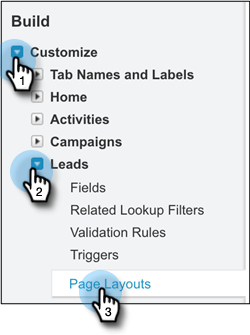
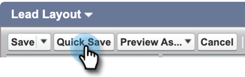

# 從Salesforce Classic解除安裝Marketo Sales Connect {#uninstall-marketo-sales-connect-from-salesforce-classic}

以下說明開始使用Sales Insight Actions後，如何從您的Salesforce帳戶解除安裝Marketo Sales Connect套件。

## 從頁面配置移除[!DNL Sales Connect]欄位 {#remove-sales-connect-fields-from-page-layout}

1. 在[!DNL Salesforce] Classic中，按一下&#x200B;**[!UICONTROL Setup]**。

   

1. 在左側導覽的[!UICONTROL Build]下，展開（但不按一下） [!UICONTROL Customize]，然後展開[!UICONTROL Leads]。 然後，選取&#x200B;**[!UICONTROL Page Layouts]**。

   

1. 按一下「銷售機會配置」旁的&#x200B;**[!UICONTROL Edit]**。

   

1. 在主控台中，選取&#x200B;**[!UICONTROL Fields]**。 在「快速尋找」中搜尋「MSC」。 所有灰色的欄位已新增至您的頁面配置。 您必須刪除這些專案。

   

   >[!NOTE]
   >
   >如果沒有欄位顯示為灰色，表示您尚未將其新增至頁面配置。 您可以略過本節。

1. 捲動到包含您的[!DNL Sales Connect]自訂欄位的區段。

   

1. 有10種型別的MSC欄位可以新增至此區段。 移除所有新增的欄位，或直接刪除整個區段。

1. 完成時，按一下&#x200B;**[!UICONTROL Quick Save]**。

   

## 從頁面配置移除[!DNL Sales Connect]按鈕 {#remove-sales-connect-buttons-from-page-layouts}

1. 在主控台（上述步驟4）中，選取&#x200B;**[!UICONTROL Buttons]**。 搜尋「MSC」。 所有灰色的按鈕已新增到您的自訂按鈕區段。 您必須刪除這些專案。

   

   >[!NOTE]
   >
   >如果沒有任何按鈕呈現灰色，表示您尚未新增這些按鈕。 您可以略過本節。

1. 將MSC按鈕從[!UICONTROL Custom Buttons]區段拖放至主控台。

   

1. 完成時，按一下&#x200B;**[!UICONTROL Quick Save]**。

   

## 從[!DNL Sales Connect]區段中移除[!UICONTROL Activity History]欄位 {#remove-sales-connect-fields-from-activity-history-section}

1. 捲動至頁面底部至[!UICONTROL Activity History]相關清單區段，然後按一下「扳手」圖示。

   

1. 從[!DNL Sales Connect]區域選取[!UICONTROL Selected Fields]欄位並按一下[!UICONTROL Remove]箭頭。 完成時，按一下&#x200B;**[!UICONTROL OK]**。

   

   >[!NOTE]
   >
   >縮寫MSE _是_ [!DNL Sales Connect]。 它只是先前名稱「Marketo銷售參與」。

1. 完成Leads頁面時，按一下&#x200B;**儲存**。

## 從潛在客戶清單檢視中移除[!DNL Sales Connect]個大量動作按鈕 {#remove-sales-connect-bulk-action-buttons-from-lead-list-view}

1. 在左側導覽的[!UICONTROL Build]下，展開（但不按一下） [!UICONTROL Customize]，然後展開[!UICONTROL Leads]。 然後，選取&#x200B;**[!UICONTROL Search Layouts]**。

   

1. 在潛在客戶清單檢視旁邊，按一下&#x200B;**[!UICONTROL Edit]**。

   

1. 選取&#x200B;**[!UICONTROL Add to MSC Campaign (Classic)]**、**[!UICONTROL Email with MSC (Classic)]**&#x200B;和&#x200B;**[!UICONTROL Push to MSC (Classic)]**，然後按一下[!UICONTROL Remove]箭頭。 然後按一下「**[!UICONTROL Save]**」。

   

您應該不會再看到潛在客戶清單檢視上的按鈕。

## 移除連絡人的MSC設定 {#remove-msc-configuration-for-contacts}

1. 在[!DNL Salesforce]中，按一下&#x200B;**[!UICONTROL Setup]**。

1. 在左側導覽的[!UICONTROL Build]下，展開（但不按一下） [!UICONTROL Customize]，然後展開[!UICONTROL Contacts]。 然後，選取&#x200B;**[!UICONTROL Page Layouts]**。

1. 在連絡人配置旁邊，按一下&#x200B;**[!UICONTROL Edit]**。

1. 從所有三個區段重複步驟。

## 移除商機的MSC設定 {#remove-msc-configuration-for-opportunity}

1. 在[!DNL Salesforce]中，按一下&#x200B;**[!UICONTROL Setup]**。

1. 在左側導覽的[!UICONTROL Build]下，展開（但不按一下） [!UICONTROL Customize]，然後展開[!UICONTROL Opportunities]。 然後，選取&#x200B;**[!UICONTROL Page Layouts]**。

1. 按一下[機會配置]旁的&#x200B;**[!UICONTROL Edit]**。

1. 從所有三個區段重複步驟。

機會檢視只有一個按鈕 — 「傳送MSE電子郵件」和以下欄位：

## 移除帳戶的MSC設定 {#remove-msc-configuration-for-account}

1. 在[!DNL Salesforce]中，按一下&#x200B;**[!UICONTROL Setup]**。

1. 在左側導覽的[!UICONTROL Build]下，展開（但不按一下） [!UICONTROL Customize]，然後展開[!UICONTROL Account]。 然後，選取&#x200B;**[!UICONTROL Page Layouts]**。

1. 按一下[帳戶配置]旁的&#x200B;**[!UICONTROL Edit]**。

1. 從所有三個區段重複步驟。

帳戶檢視只有一個按鈕 — 「傳送MSE電子郵件」和以下欄位：

## 移除Marketo銷售寄件匣 {#remove-marketo-sales-outbox}

1. 在[!DNL Salesforce]中，按一下熒幕上方的&#x200B;**+**&#x200B;索引標籤。

1. 按一下「**[!UICONTROL Customize My Tabs]**」。

1. 從右側選取「Marketo銷售寄件匣」選項。 按一下[!UICONTROL Remove]箭頭，然後按一下&#x200B;**[!UICONTROL Save]**。

## 刪除[!DNL Sales Connect]封裝 {#delete-sales-connect-package}

從Salesforce帳戶移除所有物件後，請遵循下列步驟。

1. 在[!DNL Salesforce]中，按一下&#x200B;**[!UICONTROL Setup]**。

1. 在「快速尋找」方塊中，輸入「Apex類別」。

1. 按一下清單上所有「MarketoSalesConnectionCustomization」或「MarketoSalesEngageCustomization」專案旁的&#x200B;**刪除**。

一切就緒！

以下是需要從Salesforce執行個體移除的所有物件清單：

## [!DNL Sales Connect]自訂詳細資料 {#sales-connect-customization-details}

<table>
 <tr>
  <th>自訂活動欄位</th>
  <th>說明</th>
  <th>類型</th>
  <th>資料類型</th>
 </tr>
 <tr>
  <td>[!UICONTROL MSC Call Local Presence ID]</td>
  <td>身為使用者，我可以在透過MSC電話進行呼叫時，選擇「本機顯示狀態」作為選項。 來電會顯示接收者的本機號碼</td>
  <td>活動</td>
  <td>文字</td>
 </tr>
 <tr>
  <td>[!UICONTROL MSC Call Recording URL]</td>
  <td>可以錄製通話，並在這裡記錄錄製的連結 </td>
  <td>活動</td>
  <td>文字</td>
 </tr>
 <tr>
  <td>[!UICONTROL MSC Campaign]</td>
  <td>記錄連絡人/潛在客戶所在的MSC行銷活動的名稱</td>
  <td>活動</td>
  <td>文字</td>
 </tr>
 <tr>
  <td>[!UICONTROL MSC Campaign URL]</td>
  <td>將URL記錄到在MSC中建立的行銷活動。 按一下此按鈕，就會在MSC網頁應用程式中開啟促銷活動</td>
  <td>活動</td>
  <td>文字</td>
 </tr>
 <tr>
  <td>[!UICONTROL MSC Campaign Current Step]</td>
  <td>如果連絡人/潛在客戶在行銷活動中，此欄位將記錄他們目前所在步驟的名稱</td>
  <td>活動</td>
  <td>核取方塊</td>
 </tr>
 <tr>
  <td>[!UICONTROL MSC Email Attachment Viewed]</td>
  <td>在傳送包含收件者檢視之附件的電子郵件時記錄資料</td>
  <td>活動</td>
  <td>核取方塊</td>
 </tr>
 <tr>
  <td>[!UICONTROL MSC Email Clicked]</td>
  <td>當收件者按一下電子郵件中的連結時，記錄核取記號</td>
  <td>活動</td>
  <td>核取方塊</td>
 </tr>
 <tr>
  <td>[!UICONTROL MSC Email Replied]</td>
  <td>在收件者回覆電子郵件時記錄核取記號</td>
  <td>活動</td>
  <td>文字</td>
 </tr>
 <tr>
  <td>[!UICONTROL MSC Email Status]</td>
  <td>顯示電子郵件是否已傳送/進行中/退回（追蹤退回電子郵件取決於使用的傳遞頻道）</td>
  <td>活動</td>
  <td>文字</td>
 </tr>
 <tr>
  <td>[!UICONTROL MSC Email Template]</td>
  <td>記錄用於傳送給潛在客戶/連絡人的電子郵件中的MSC範本名稱</td>
  <td>活動</td>
  <td>文字</td>
 </tr>
 <tr>
  <td>[!UICONTROL MSC Email Template URL]</td>
  <td>將URL記錄到在MSC中建立的範本。 按一下此選項會在MSC網頁應用程式中開啟範本</td>
  <td>活動</td>
  <td>文字</td>
 </tr>
 <tr>
  <td>[!UICONTROL MSC Email URL]</td>
  <td>按一下此URL將會開啟MSC中的命令中心，並拉出「人員詳細資料檢視歷史記錄」標籤，使用者可以在其中檢視已傳送的電子郵件</td>
  <td>活動</td>
  <td>文字</td>
 </tr>
 <tr>
  <td>[!UICONTROL MSC Email Viewed]</td>
  <td>在收件者檢視電子郵件時記錄核取記號</td>
  <td>活動</td>
  <td>核取方塊</td>
 </tr>
</table>

<table>
 <tr>
  <th>MSC累計記錄欄位</th>
  <th>說明</th>
  <th>類型</th>
  <th>資料類型</th>
 </tr>
 <tr>
  <td>MSC — 上次行銷參與</td>
  <td>上次來自行銷的傳入參與</td>
  <td>
  
帳戶 
  
聯絡人 
  
銷售機會 
  
機會</td>
  <td>資料與時間</td>
 </tr>
 <tr>
  <td>MSC — 上次行銷參與日期</td>
  <td>來自行銷的參與時間戳記</td>
  <td>
  
帳戶 
  
聯絡人 
  
銷售機會 
  
機會</td>
  <td>資料與時間</td>
 </tr>
 <tr>
  <td>MSC — 上次行銷參與摘要</td>
  <td>參與的說明</td>
  <td>
  
帳戶 
  
聯絡人 
  
銷售機會 
  
機會</td>
  <td>文字</td>
 </tr>
 <tr>
  <td>MSC — 上次行銷參與Source</td>
  <td>行銷參與的Source</td>
  <td>
  
帳戶 
  
聯絡人 
  
銷售機會 
  
機會</td>
  <td>文字</td>
 </tr>
 <tr>
  <td>MSC — 上次行銷參與型別</td>
  <td>參與型別（例如：網路活動）</td>
  <td>
  
帳戶 
  
聯絡人 
  
銷售機會 
  
機會</td>
  <td>文字</td>
 </tr>
 <tr>
  <td>MSC — 按銷售列出的最後作業</td>
  <td>銷售團隊執行的最後一個傳出活動</td>
  <td>
  
帳戶 
  
聯絡人 
  
銷售機會 
  
機會</td>
  <td>資料與時間</td>
 </tr>
 <tr>
  <td>MSC — 上次回覆</td>
  <td>銷售電子郵件的最後一封電子郵件回覆</td>
  <td>
  
帳戶 
  
聯絡人 
  
銷售機會 
  
機會</td>
  <td>資料與時間</td>
 </tr>
 <tr>
  <td>MSC — 目前的促銷活動</td>
  <td>記錄連絡人/潛在客戶所在的MSC行銷活動的名稱</td>
  <td>
  
帳戶 
  
聯絡人 
  
銷售機會 
  
機會</td>
  <td>文字</td>
 </tr>
 <tr>
  <td>MSC — 上次銷售業務開發</td>
  <td>上次來自銷售人員的傳入參與</td>
  <td>
  
帳戶 
  
聯絡人 
  
銷售機會 
  
機會</td>
  <td>資料與時間</td>
 </tr>
 <tr>
  <td>MSC — 選擇退出</td>
  <td>選擇退出欄位</td>
  <td>
  
帳戶 
  
聯絡人 
  
銷售機會 
  
機會</td>
  <td>核取方塊</td>
 </tr>
</table>

<table>
 <tr>
  <th>MSC按鈕</th>
  <th>說明</th>
  <th>類型</th>
 </tr>
 <tr>
  <td>[!UICONTROL Send MSC Email]</td>
  <td>傳送銷售電子郵件自 [!DNL Salesforce]</td>
  <td>
  
帳戶 
  
聯絡人 
  
銷售機會 
  
機會</td>
 </tr>
 <tr>
  <td>[!UICONTROL Add to MSC Campaign]</td>
  <td>從新增至MSC行銷活動 [!DNL Salesforce]</td>
  <td>
  
聯絡人
  
銷售機會</td>
 </tr>
 <tr>
  <td>[!UICONTROL Push to MSC]</td>
  <td>從[!DNL Salesforce]推播連絡人至MSC</td>
  <td>
  
聯絡人
  
銷售機會</td>
 </tr>
 <tr>
  <td>[!UICONTROL Call with MSC]</td>
  <td>從進行銷售通話 [!DNL Salesforce]</td>
  <td>
  
聯絡人
  
銷售機會</td>
 </tr>
</table>

<table>
 <tr>
  <th>MSC大量作業按鈕</th>
  <th>說明</th>
  <th>類型</th>
 </tr>
 <tr>
  <td>[!UICONTROL Add to MSC Campaign (Classic)]</td>
  <td>從新增至MSC行銷活動 [!DNL Salesforce]</td>
  <td>
  
聯絡人
  
銷售機會</td>
 </tr>
 <tr>
  <td>[!UICONTROL Push to MSC (Classic)]</td>
  <td>從[!DNL Salesforce]推播連絡人至MSC</td>
  <td>
  
聯絡人
  
銷售機會</td>
 </tr>
 <tr>
  <td>[!UICONTROL Email with MSC (Classic)]</td>
  <td>從MSC寄送電子郵件 [!DNL Salesforce]</td>
  <td>
  
聯絡人
  
銷售機會</td>
 </tr>
</table>
