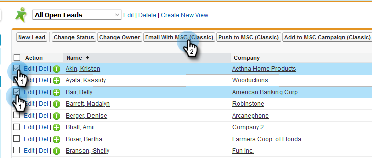

# 在Salesforce Classic中使用大量動作 {#using-bulk-actions-in-salesforce-classic}

瞭解如何執行大量動作，例如將銷售機會新增至行銷活動、傳送大量電子郵件，或將銷售機會從Salesforce推送至Sales Connect。

>[!PREREQUISITES]
>
>更新至最新版Sales Connect套件，並在您的銷售機會/聯絡人檢視中安裝大量動作按鈕。 [按一下這裡以取得指示](https://s3.amazonaws.com/tout-user-store/salesforce/assets/Marketo+Sales+Engage+For+Salesforce_+Installation+and+Success+Guide.pdf).

>[!NOTE]
>
>在依照列出的步驟操作之前，請確定您已登入您的Marketo Sales Connect帳戶。

## 大量電子郵件 {#bulk-email}

1. 在Salesforce中，按一下 **銷售機會** 標籤，然後 **前往** 按鈕。

   

1. 選擇所需的銷售機會，然後按一下 **使用MSC (Classic)傳送電子郵件** 按鈕。

   

1. MSC電子郵件將會彈出。 它包含下列功能：

   答：「收件者」欄位會顯示「所有收貨」 — 這對應於您在「銷售機會清單檢視表」中選擇的銷售機會清單\
   b.此清單顯示在名為「大量撰寫」的左側面板上 — 您可以在此處新增/移除收件者\
   c.您可以選擇範本或建立您自己的電子郵件\
   d.您可以預覽將填入電子郵件中的動態欄位\
   e.您可以立即傳送電子郵件，或排程在稍後傳送

   

## 新增至行銷活動 {#add-to-campaign}

1. 在Salesforce中，按一下 **銷售機會** 標籤，然後 **前往** 按鈕。

   

1. 選擇所需的銷售機會，然後按一下 **新增至MSC Campaign (Classic)** 按鈕。

   

1. 將會出現「將人員新增至您的行銷活動」快顯視窗。 按一下 **下一個** 並透過一般促銷活動流程觸發MSC促銷活動。

   

## 推送至Marketo Sales Connect {#push-to-marketo-sales-connect}

1. 在Salesforce中，按一下 **銷售機會** 標籤，然後 **前往** 按鈕。

   

1. 選擇所需的銷售機會，然後按一下 **推送至MSC （傳統）** 按鈕。

   

1. 名為「Salesforce Bridge」的新標籤將會開啟。 按一下 **繼續前往群組→** 按鈕。

   

1. 系統會將您傳送至您的MSC帳戶，您會在其中看到以日期/時間戳記建立的群組。 同步完成後，您會收到通知，群組將包含從Salesforce同步的銷售機會。

   

>[!NOTE]
>
>您也可以依照相同的步驟，在「連絡人清單檢視」中使用大量動作。

>[!MORELIKETHIS]
>
>* [透過群組電子郵件傳送電子郵件](/help/marketo/product-docs/marketo-sales-connect/email/using-the-compose-window/sending-emails-via-group-email.md)
>* [使用「選取並傳送」撰寫大量電子郵件](/help/marketo/product-docs/marketo-sales-connect/email/using-the-compose-window/composing-bulk-emails-with-select-and-send.md#sending-emails)
