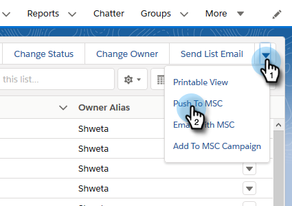

# 在Salesforce Lightning中使用大量動作{#using-bulk-actions-in-salesforce-lightning}

瞭解如何執行大量動作，例如新增銷售機會至促銷活動、傳送大量電子郵件或將銷售機會從Salesforce推送至Sales Connect。

>[!PREREQUISITES]
>
>更新至最新版的Sales Connect套件，並在銷售機會／聯絡人檢視中安裝大量動作按鈕。 [按一下這裡以取得指示](https://s3.amazonaws.com/tout-user-store/salesforce/assets/SF+Guide+for+Lightning.pdf)。

>[!NOTE]
>
>在執行下列步驟之前，請確定您已登入您的Marketo Sales Connect帳戶。

## 大量電子郵件{#bulk-email}

1. 在Salesforce中，按一下&#x200B;**Leads**&#x200B;標籤，然後選擇所需銷售機會的清單。

   

   >[!NOTE]
   >
   >如果您已經在要使用的清單中，則必須從下拉式清單中選擇該清單，以確保顯示MSC批量操作按鈕。 這是無法變更的Salesforce行為。

1. 按一下箭頭下拉式清單（位於螢幕最右側），然後選擇「**使用MSC**&#x200B;發送電子郵件」。

   

1. MSC電子郵件會彈出。 它包含下列功能：

   a.「收貨人」欄位顯示「所有收款」-此欄位與您在「銷售線索清單視圖」中選擇的銷售線索清單相對應\
   b.此清單顯示在名為「批量合成」的左側面板上——您可在此處新增／移除收件者\
   c.您可以選擇範本或建立自己的電子郵件\
   d.您可以立即傳送電子郵件，或排程稍後傳送

   

## 新增至促銷活動{#add-to-campaign}

1. 在Salesforce中，按一下&#x200B;**Leads**&#x200B;標籤，然後選擇所需銷售機會的清單。

   

1. 按一下箭頭下拉式清單（位於畫面最右側），然後選取「新增至MSC Campaign **」。**

   

1. 將會出現「將人員新增至您的促銷活動」快顯視窗。 按一下「下一步」並瀏覽典型的促銷活動流程，以觸發MSC促銷活動。****

   

## 推送至Marketo Sales Connect {#push-to-marketo-sales-connect}

1. 在Salesforce中，按一下&#x200B;**Leads**&#x200B;標籤，然後選擇所需銷售機會的清單。

   

1. 按一下箭頭下拉式選單（位於螢幕最右側），然後選擇「Push to MSC **（推送至MSC**）」。

   

1. 將會開啟名為「Salesforce Bridge」的新標籤。 按一下&#x200B;**繼續到組→**&#x200B;按鈕。

   

1. 您將會被傳送至您的MSC帳戶，您將在該帳戶中看到使用日期／時間戳記建立的群組。 同步完成後，您會收到通知，群組將包含與Salesforce同步的潛在客源。

   

>[!NOTE]
>
>您也可以遵循相同的步驟，在「連絡人清單檢視」中使用大量動作。

>[!MORELIKETHIS]
>
>* [透過群組電子郵件傳送電子郵件](/help/marketo/product-docs/marketo-sales-connect/email/using-the-compose-window/sending-emails-via-group-email.md)
>* [使用選擇和傳送撰寫大量電子郵件](/help/marketo/product-docs/marketo-sales-connect/email/using-the-compose-window/composing-bulk-emails-with-select-and-send.md#sending-emails)

